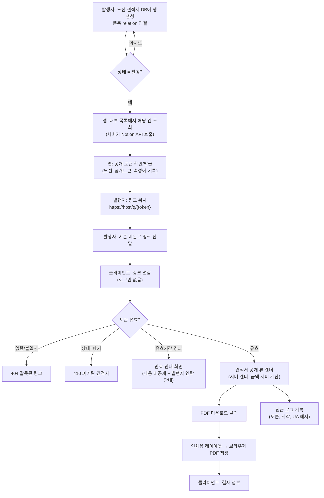
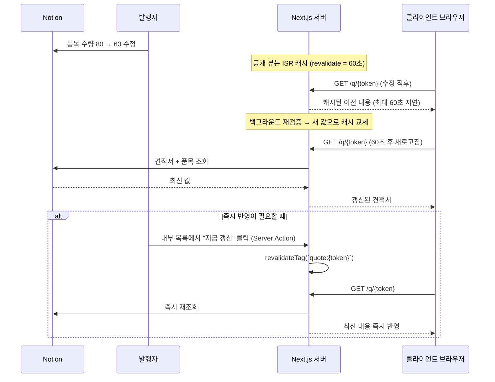
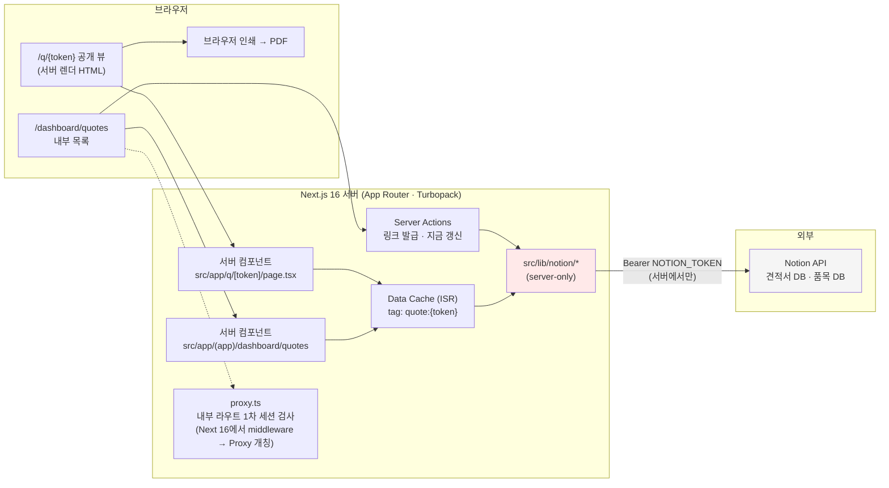

# PRD — 노션 기반 견적서 웹 열람 / PDF 다운로드 (MVP)

## 1. 문서 정보

| 항목 | 내용 |
|------|------|
| 제품명 | Invoice Web (가칭) — 노션 견적서 웹 발행기 |
| 작성일 | 2026-07-20 |
| 버전 | v0.2 (v0.1에서 Next 16 실측 반영: `middleware`→`proxy` 개칭, 이전 모델 캐싱 API 정정, 캐시 함정 3건·리스크 R11~R13 추가) |
| 작성자 | 프로덕트/기술 PM (Claude Code 작성, 발행자 검토 대기) |
| 상태 | **Draft** — 13절 열린 질문 확정 시 Confirmed 승격 |
| 대상 저장소 | `/Users/brightmacbookpro/workspace/courses/invoice-web` |
| 기술 전제 출처 | 저장소 `CLAUDE.md` · `AGENTS.md` · `node_modules/next/dist/docs/` (실제 확인함) |

### 확정된 전제 (사용자 응답)

| 항목 | 확정값 |
|------|--------|
| 클라이언트 인증 | **공개 링크(추측 불가 토큰)** — 로그인/비밀번호 없음 |
| 노션 데이터 구조 | **견적서 DB 1행 = 견적서 1건**, 품목은 **별도 관계형(relation) DB** |
| PDF 디자인 수준 | **깔끔하면 충분** (사내 표준 양식 픽셀 재현 불필요) |
| 규모·일정 | **1인 발행자, 월 20건 내외 / 3주 내 첫 고객 전달** |

---

## 2. 배경과 문제 정의

### 현재 워크플로

```
노션에 견적 정보 입력  →  한글/엑셀 파일을 수기로 다시 작성  →  숫자·합계 직접 계산
  →  PDF로 내보내기  →  메일에 첨부해 발송  →  수정 요청 오면 위 과정 전부 반복
```

### 구체적 병목

| 병목 | 설명 | 정량 추정(가정, 13절 A-1) |
|------|------|--------------------------|
| 이중 입력 | 노션에 이미 있는 데이터를 문서 도구에 다시 옮겨 적는다 | 건당 12~15분 |
| 수기 계산 | 공급가액·부가세·합계를 사람이 계산 → 오기 위험 | 건당 3분, 오류율 체감 5% 내외 |
| 수정 재발행 | 금액 한 줄만 바뀌어도 문서 재작성 + 재발송 | 수정 1회당 10분 |
| 진실 원본 분산 | 노션 값과 발송된 PDF가 달라져 "어느 게 최신인가" 혼선 | 정성적 |
| 열람 여부 불가시 | 고객이 견적서를 봤는지 알 수 없어 후속 연락 타이밍을 놓침 | 정성적 |

### 방치 비용

월 20건 × (발행 15분 + 수정 10분) ≈ **월 8시간**의 반복 작업. 여기에 금액 오기 1건이 실제
계약 분쟁으로 번지면 시간 손실과는 비교되지 않는 신뢰 비용이 발생한다.

### 해결의 본질

**노션을 단일 진실 원본(SSOT)으로 두고, 웹은 읽기 전용 뷰어로만 만든다.**
앱은 데이터를 소유하지 않는다. 노션 값이 바뀌면 링크가 가리키는 내용도 바뀐다.
"문서를 만들어 보내는 일"을 "링크를 보내는 일"로 바꾸는 것이 이 제품의 전부다.

---

## 3. 목표와 비목표

### 3.1 목표 (MVP)

| # | 목표 | 성립 조건 |
|---|------|-----------|
| G1 | 노션에 입력한 견적서를 **재입력 없이** 웹 링크로 발행한다 | 발행자가 노션 외 다른 곳에 데이터를 입력하지 않는다 |
| G2 | 클라이언트가 **로그인 없이** 링크를 열어 견적서를 본다 | 모바일 브라우저 포함 |
| G3 | 클라이언트가 **한글이 깨지지 않는 PDF**를 내려받는다 | A4 기준, 표 행이 페이지 경계에서 잘리지 않음 |
| G4 | 노션 수정이 **기존 링크에 반영**된다 (링크 재발급 불필요) | 수정 → 재검증 → 동일 URL이 최신 내용 표시 |
| G5 | 링크가 **검색엔진에 노출되지 않고 만료**될 수 있다 | 금액이 담긴 민감 문서로 취급 |

### 3.2 비목표 (Non-goals) — MVP에서 **하지 않는다**

| # | 하지 않는 것 | 이유 |
|---|--------------|------|
| N1 | 웹에서의 견적서 **생성·편집** | 노션이 SSOT다. 편집 UI를 만드는 순간 진실 원본이 둘이 된다 |
| N2 | 클라이언트 **계정/로그인/초대** | 1인·월 20건 규모에서 인증 인프라는 과잉. 추측 불가 토큰으로 충분 |
| N3 | 전자 **서명·승인 워크플로**(고객이 웹에서 "승인" 클릭) | 법적 효력 검토가 필요한 별도 제품 영역 |
| N4 | **세금계산서 발행 연동**(홈택스/팝빌 등) | 외부 인증·사업자 심사 필요, 3주 안에 불가 |
| N5 | **다국어·다통화** | 현 고객 전원 국내·KRW (가정 A-2) |
| N6 | **결제 링크·입금 확인** | 견적 단계 제품. 청구는 별개 |
| N7 | **사내 표준 양식 픽셀 재현**(도장 이미지 위치까지 일치) | 사용자 확정: "깔끔하면 충분" |
| N8 | **이메일 자동 발송** | 발행자가 링크를 복사해 기존 메일로 보낸다. 발송 인프라(SPF/DKIM) 회피 |
| N9 | **다중 사용자 권한 관리** | 발행자 1인 |
| N10 | **견적서 버전 히스토리 보관**(스냅샷) | 노션 페이지 히스토리로 대체. 단 리스크 R4 참조 |
| N11 | **PDF 워터마크·암호** | 만료·비색인으로 1차 방어. 필요 시 2단계 |

---

## 4. 성공 지표

| 지표 | 현재(기준선, 가정) | MVP 목표 | 측정 방법 |
|------|------------------|----------|-----------|
| 견적서 1건 발행 소요시간 | 15~20분 | **2분 이내** | 발행자가 노션 입력 완료 → 링크 복사까지 스톱워치 측정, 5건 평균 |
| 수정 후 재발행 소요시간 | 10분 | **30초 이내** (노션 수정 + 반영 대기) | 노션 값 변경 → 공개 링크 새로고침에 반영되기까지 |
| 링크 열람률 | 측정 불가 | **80% 이상** | 발행 건수 대비 최소 1회 열람된 건수 (접근 로그) |
| PDF 다운로드 성공률 | — | **99% 이상** | 다운로드 시도 대비 오류 없이 파일 생성된 비율 |
| 한글 깨짐 발생 건수 | — | **0건** | Chrome·Safari·모바일 Safari 3환경 수동 검증 |
| 공개 뷰 LCP | — | **2.5초 이하** (4G 모바일) | Lighthouse |
| 금액 오기 건수 | 월 ~1건 | **0건** | 노션 값과 웹 표시값 대사(對査). 계산은 전부 서버가 수행 |

> 측정 시작 시점: 마일스톤 M3(첫 고객 전달) 이후 2주간.

---

## 5. 사용자와 시나리오

### 페르소나 A — 발행자 "정민" (1인 사업자/프리랜서 PM)

- 노션으로 고객·프로젝트를 관리한다. 노션 DB 구조를 직접 만들 수 있다.
- 개발자는 아니다. 배포·환경변수는 한 번 세팅해주면 그대로 쓴다.
- 통증: "노션에 다 있는데 왜 또 한글 파일을 만들어야 하지?"

**End-to-End 시나리오**

정민은 신규 고객 A사와 미팅을 마치고 노션 `견적서` DB에 새 행을 만든다. 고객사명, 담당자,
유효기간을 채우고 `품목` DB에서 3개 항목(기획 40시간, 디자인 20시간, 개발 80시간)을 관계형으로
연결한다. 단가를 입력하면 노션 수식이 각 행의 금액을 계산해 준다. 마지막으로 `상태` 속성을
`발행`으로 바꾼다. 웹 앱의 내부 견적서 목록을 열어 새로고침하면 A사 견적서가 "발행됨"으로
나타나고, 옆의 **링크 복사** 버튼을 누른다. 클립보드에 `https://.../q/8f3k...` 가 담긴다.
정민은 평소 쓰던 메일에 그 링크만 붙여 보낸다. 소요 1분 40초.

다음 날 A사가 "개발 80시간을 60시간으로 줄여달라"고 한다. 정민은 노션 품목 행의 수량만 60으로
고친다. 링크는 그대로다. 1분 뒤 A사가 같은 링크를 새로고침하면 합계가 갱신되어 있다.

### 페르소나 B — 클라이언트 "이 팀장" (고객사 구매 담당)

- 견적서를 받아 사내 결재 시스템에 **PDF 파일로 첨부**해야 한다.
- 링크·로그인·앱 설치를 싫어한다. 모바일에서 먼저 열어본다.
- 통증: "PDF로 안 주면 결재를 못 올린다."

**End-to-End 시나리오**

이 팀장은 출근길 지하철에서 메일의 링크를 누른다. 모바일 브라우저에 견적서가 세로로 읽기 좋게
뜬다(품목 표가 가로 스크롤 없이 카드 형태로 접힌다). 총액과 유효기간(2026-08-19)을 확인한다.
사무실에 도착해 같은 링크를 PC에서 열고 **PDF 다운로드**를 누른다. `견적서_A사_20260720.pdf`가
받아진다. 파일을 열어보니 한글이 정상이고 A4 2장, 표가 페이지 중간에서 잘리지 않았다.
그대로 결재에 첨부한다. 링크는 어디에도 로그인을 요구하지 않았다.

---

## 6. 핵심 사용자 흐름

### 6.1 발행 → 열람 → 다운로드



### 6.2 수정 시 기존 링크의 동작 (재검증·캐시 무효화)

**원칙: 링크는 불변, 내용은 가변.** 토큰은 노션 행에 1회 발급되어 고정되고, 페이지 내용은
매 요청마다 캐시 정책에 따라 최신 노션 값으로 채워진다.



**정책 결정**

| 상황 | 동작 |
|------|------|
| 노션 값 수정 | 기존 링크 유지. 최대 60초 내 자동 반영 |
| 즉시 반영 필요 | 발행자가 내부 목록에서 "지금 갱신" → `revalidateTag` 즉시 무효화 |
| 상태 `발행` → `폐기` | 다음 요청부터 410 화면. 캐시 무효화는 "지금 갱신"으로 강제 가능 |
| 유효기간 경과 | 만료 화면(금액 비공개). 날짜 비교는 **요청 시각 기준**이라 캐시 지연과 무관하게 정확해야 함 → 만료 판정은 캐시된 데이터 위에서 **렌더 시점에 재계산** |
| 이미 다운로드된 PDF | 회수 불가. PDF 하단에 **발행 시각과 유효기간**을 인쇄해 "언제 기준 문서인지" 남긴다 |

---

## 7. 기능 요구사항

우선순위: **MoSCoW**. Must는 "노션 입력 → 클라이언트가 PDF를 받는다"가 끊기지 않는 최소 집합.

### 7.1 Must — MVP 정의 집합

| ID | 기능 | 사용자 스토리 | 수용 기준 (Given–When–Then) | 우선순위 |
|----|------|--------------|---------------------------|---------|
| F-01 | 노션 견적서 조회 | 발행자로서, 노션에 입력한 견적서를 앱이 읽어오길 원한다 | **Given** 노션 견적서 DB에 상태=`발행`인 행이 있고 통합이 해당 DB에 연결되어 있을 때 **When** 서버가 조회를 수행하면 **Then** 해당 행의 모든 매핑 속성(8절 표)이 앱 타입으로 파싱되어 반환된다. **And** 통합 연결이 없으면 500이 아닌 "노션 연결 확인 필요" 오류 메시지를 반환한다 | Must |
| F-02 | 품목(relation) 조회 | 발행자로서, 품목 DB의 행들이 견적서에 딸려 오길 원한다 | **Given** 견적서 행에 품목 3건이 relation으로 연결되어 있을 때 **When** 견적서를 조회하면 **Then** 품목 3건이 `sortOrder` 오름차순으로 배열에 담긴다. **And** relation이 비어 있으면 빈 배열을 반환하고 화면은 "품목 없음" 빈 상태를 표시한다(예외 던지지 않음) | Must |
| F-03 | 금액 서버 계산 | 클라이언트로서, 합계가 정확하길 원한다 | **Given** 품목 `수량×단가`의 합이 1,000,000원이고 부가세율 10%일 때 **When** 견적서를 렌더하면 **Then** 공급가액 1,000,000 / 부가세 100,000 / 합계 1,100,000이 표시된다. **And** 모든 계산은 서버에서 **정수(원 단위)** 로 수행하고 부가세는 **원 단위 절사(내림)** 한다. **And** 노션에 합계 속성이 있어도 앱은 이를 **신뢰하지 않고 재계산**하며, 불일치 시 내부 목록에 경고 배지를 띄운다 | Must |
| F-04 | 공개 토큰 발급 | 발행자로서, 추측 불가능한 링크를 얻길 원한다 | **Given** 상태=`발행`이고 `공개토큰` 속성이 비어 있는 견적서를 내부 목록에서 열 때 **When** "링크 발급"을 실행하면 **Then** 128비트 이상의 암호학적 난수(`crypto.randomUUID()` 또는 base64url 22자 이상)가 생성되어 노션 `공개토큰` 속성에 기록되고 `/q/{token}` 링크가 반환된다. **And** 이미 토큰이 있으면 재발급하지 않고 기존 토큰을 반환한다 | Must |
| F-05 | 토큰으로 공개 뷰 접근 | 클라이언트로서, 로그인 없이 링크로 견적서를 보길 원한다 | **Given** 유효한 토큰일 때 **When** `/q/{token}`에 접근하면 **Then** 로그인 요구 없이 견적서 상세가 200으로 렌더된다. **And** 존재하지 않는 토큰이면 **404**를 반환하며 "왜 없는지"(폐기/오타/만료)를 구분해 알려주지 않는다(열거 공격 방지) | Must |
| F-06 | 유효기간 만료 처리 | 발행자로서, 지난 견적이 유효한 것처럼 보이지 않길 원한다 | **Given** 유효기간이 어제인 견적서일 때 **When** 클라이언트가 링크를 열면 **Then** 금액·품목이 **표시되지 않고** "이 견적서는 2026-08-19에 만료되었습니다. 발행자에게 문의해 주세요" 화면이 뜬다. **And** 유효기간이 비어 있으면 만료로 보지 않고 정상 표시한다 | Must |
| F-07 | 폐기 처리 | 발행자로서, 잘못 보낸 링크를 죽이길 원한다 | **Given** 노션 상태를 `폐기`로 바꾸고 "지금 갱신"을 눌렀을 때 **When** 클라이언트가 같은 링크를 열면 **Then** 410 상태로 "더 이상 유효하지 않은 링크" 화면이 뜨고 견적 내용은 어디에도 포함되지 않는다(HTML 소스 포함) | Must |
| F-08 | 견적서 공개 뷰(반응형) | 클라이언트로서, 모바일에서도 읽기 편하길 원한다 | **Given** 375px 폭 뷰포트일 때 **When** 공개 뷰를 열면 **Then** 가로 스크롤이 발생하지 않고 품목 표가 카드형으로 전환된다. **And** 768px 이상에서는 표 형태로 표시된다. **And** 전환은 CSS(`hidden md:*`)로 처리하며 JS 미디어쿼리에 의존하지 않는다 | Must |
| F-09 | PDF 다운로드 | 클라이언트로서, 결재에 첨부할 PDF를 받길 원한다 | **Given** 공개 뷰에서 **When** "PDF 다운로드"를 누르면 **Then** 인쇄 대화상자가 열리고 A4 세로로 저장했을 때 (a) 한글이 깨지지 않고 (b) 품목 표의 한 행이 페이지 경계에서 분리되지 않으며 (c) 페이지마다 "n/m" 쪽번호와 견적서 번호가 인쇄된다. **And** 화면 전용 요소(버튼·네비게이션·테마 토글)는 인쇄물에 포함되지 않는다 | Must |
| F-10 | 검색엔진 색인 차단 | 발행자로서, 견적서가 검색에 뜨지 않길 원한다 | **Given** 배포된 서비스일 때 **When** `/robots.txt`를 조회하면 **Then** `/q/`가 Disallow에 포함된다. **And** `/q/{token}` 응답 헤드에 `robots: { index: false, follow: false }` 메타가 존재한다. **And** 응답 헤더에 `X-Robots-Tag: noindex, nofollow`가 있다 | Must |
| F-11 | 내부 견적서 목록 | 발행자로서, 어떤 건이 발행됐고 링크가 뭔지 한눈에 보길 원한다 | **Given** 관리자 인증을 통과한 상태에서 **When** `/dashboard/quotes`를 열면 **Then** 상태·고객사·합계·유효기간·링크 유무가 표로 표시되고 각 행에 "링크 복사" 버튼이 있다. **And** 노션 조회 실패 시 빈 화면이 아니라 오류 배너 + 재시도 버튼을 표시한다 | Must |
| F-12 | 내부 화면 접근 제어 | 발행자로서, 남이 내 견적서 목록을 못 보길 원한다 | **Given** 인증 쿠키가 없는 상태에서 **When** `/dashboard/quotes`에 접근하면 **Then** `/login`으로 리다이렉트된다. **And** 인증은 서버 환경변수의 단일 비밀번호 검증 + HttpOnly·Secure·SameSite=Lax 세션 쿠키로 수행한다(1인 사용 전제). **And** 리다이렉트는 `proxy.ts`(Next 16에서 `middleware.ts`가 Proxy로 개칭됨)의 **낙관적 검사**일 뿐이며, 실제 권한 판정은 데이터 접근 계층(견적서 조회 함수)에서 **한 번 더** 수행한다 — 공식 문서가 Proxy를 완전한 세션·인가 수단으로 쓰지 말라고 명시한다. **And** `proxy.ts` 우회로 데이터 계층에 직접 도달해도 인증 없이는 노션 데이터가 반환되지 않는다 | Must |
| F-13 | 노션 토큰 서버 전용 | 발행자로서, 내 노션 데이터가 새지 않길 원한다 | **Given** 배포된 앱일 때 **When** 브라우저에 전달된 HTML·JS 번들·RSC 페이로드를 전수 검색하면 **Then** `NOTION_TOKEN` 값과 노션 DB ID가 **단 한 곳에도 나타나지 않는다**. **And** 노션 관련 코드는 `server-only` 패키지로 보호되어 클라이언트 컴포넌트에서 import 시 빌드가 실패한다 | Must |
| F-14 | 오류 상태 처리 | 클라이언트로서, 문제가 생겨도 뭘 해야 할지 알길 원한다 | **Given** 노션 API가 5xx 또는 타임아웃일 때 **When** 공개 뷰를 열면 **Then** 스택트레이스가 아닌 "일시적으로 견적서를 불러오지 못했습니다. 잠시 후 다시 시도해 주세요" 화면과 재시도 버튼이 표시된다. **And** 마지막 성공 캐시가 있으면 그것을 우선 노출하고 상단에 "최신이 아닐 수 있음" 안내를 띄운다 | Must |

**Must 판정 근거 (없으면 제품이 성립하지 않는 이유)**

| ID | 근거 |
|----|------|
| F-01·F-02 | 데이터가 없으면 아무것도 없다 |
| F-03 | 금액이 틀린 견적서는 있느니만 못하다. 오기 방지가 도입 명분의 절반 |
| F-04·F-05 | 링크가 없으면 전달 수단이 없다. 인증을 안 쓰기로 한 이상 토큰이 유일한 접근 제어 |
| F-06·F-07 | 만료·폐기 없는 영구 공개 링크는 금액 문서를 인터넷에 방치하는 것 |
| F-08 | 클라이언트 첫 열람은 모바일이라는 시나리오 전제. 깨지면 신뢰 붕괴 |
| F-09 | "결재에 PDF 첨부"가 클라이언트의 실제 목적. 이게 없으면 링크만 보낸 셈 |
| F-10 | 견적 금액이 구글에 노출되면 사업상 사고. 되돌릴 수 없음 |
| F-11 | 링크를 얻는 유일한 경로 |
| F-12 | F-11이 무방비면 전 고객 견적이 공개된다 |
| F-13 | 노션 토큰 유출 = 워크스페이스 전체 유출 |
| F-14 | 외부 API 의존 제품에서 장애는 예외가 아니라 일상 |

### 7.2 Should / Could / Won't

| ID | 기능 | 사용자 스토리 | 수용 기준 (Given–When–Then) | 우선순위 |
|----|------|--------------|---------------------------|---------|
| F-20 | "지금 갱신" 즉시 재검증 | 발행자로서, 수정을 바로 반영하고 싶다 | **Given** 노션 값을 수정한 직후 **When** 내부 목록에서 "지금 갱신"을 누르면 **Then** `revalidateTag`가 호출되고 공개 뷰 새로고침 시 즉시 새 값이 보인다 | Should |
| F-21 | 접근 로그·열람 여부 표시 | 발행자로서, 고객이 봤는지 알고 싶다 | **Given** 클라이언트가 링크를 1회 열었을 때 **When** 내부 목록을 보면 **Then** "최초 열람 / 최근 열람 / 열람 횟수"가 표시된다. **And** 로그에는 IP 원문 대신 해시를 저장한다. **And** 기록은 페이지 렌더 경로가 아니라 **별도 Route Handler(비콘)** 로 수행해 공개 뷰의 ISR 캐시를 깨지 않는다(10.3 함정 2) | Should |
| F-22 | 링크 복사 토스트 | 발행자로서, 복사됐는지 확인하고 싶다 | **Given** 링크 복사 클릭 **When** 클립보드 기록 성공 **Then** sonner 토스트 "링크를 복사했습니다" 표시. 실패 시 URL 텍스트를 선택 가능한 형태로 노출 | Should |
| F-23 | 부가세 별도/포함/면세 선택 | 발행자로서, 면세 거래도 처리하고 싶다 | **Given** 노션 `과세구분`이 `면세`일 때 **When** 렌더하면 **Then** 부가세 행이 0원으로 표시되고 "면세" 배지가 붙는다 | Should |
| F-24 | 발행자 로고·서명 이미지 | 발행자로서, 문서에 신뢰감을 주고 싶다 | **Given** 환경변수/public에 로고 파일이 있을 때 **When** 공개 뷰·PDF를 보면 **Then** 헤더에 로고가, 공급자 서명란에 도장 이미지가 인쇄된다 | Could |
| F-25 | 견적서 스냅샷 보관 | 발행자로서, 보낸 시점 내용을 증빙하고 싶다 | **Given** 발행 시점 **When** 스냅샷을 저장하면 **Then** 이후 노션이 바뀌어도 스냅샷 조회가 가능하다 | Could |
| F-26 | 서버 생성 PDF(헤드리스) | 클라이언트로서, 버튼 한 번에 파일을 받고 싶다 | (10.2 비교 참조) | Could |
| F-27 | 만료 임박 알림 | 발행자로서, 유효기간 하루 전 알림을 받고 싶다 | — | Could |
| F-28 | 웹에서 견적서 편집 | — | — | **Won't** (N1) |
| F-29 | 전자서명·승인 | — | — | **Won't** (N3) |
| F-30 | 세금계산서 연동 | — | — | **Won't** (N4) |
| F-31 | 다국어·다통화 | — | — | **Won't** (N5) |

---

## 8. 데이터 모델

### 8.1 노션 스키마 (앱이 요구하는 구조)

**DB 1 — `견적서`** (1행 = 견적서 1건)
**DB 2 — `견적품목`** (1행 = 품목 1줄, `견적서` DB로 relation)

### 8.2 매핑표 — 견적서 DB

| 노션 속성명 | 노션 타입 | 앱 필드명 | 앱 타입 | 필수 | 비어 있을 때의 동작 |
|------------|----------|----------|--------|:---:|-------------------|
| 이름 | title | `title` | `string` | ✅ | 견적서 번호로 대체 표시. 둘 다 없으면 `"제목 없음"` |
| 견적번호 | rich_text | `quoteNo` | `string` | ✅ | 노션 페이지 ID 앞 8자로 자동 생성(`Q-8f3k21a0`) |
| 상태 | select (`초안`/`발행`/`폐기`) | `status` | `QuoteStatus` | ✅ | `초안`으로 간주 → 목록에만 보이고 링크 발급 불가 |
| 공개토큰 | rich_text | `publicToken` | `string \| null` | ❌ | `null` → 링크 미발급 상태. F-04로 발급 |
| 고객사명 | rich_text | `client.company` | `string` | ✅ | `"고객사 미기재"` 표시, 내부 목록에 경고 배지 |
| 고객담당자 | rich_text | `client.contact` | `string \| null` | ❌ | 담당자 줄 자체를 렌더하지 않음 |
| 고객이메일 | email | `client.email` | `string \| null` | ❌ | 줄 미표시 |
| 발행일 | date | `issuedAt` | `string(YYYY-MM-DD)` | ✅ | 노션 `created_time`으로 대체 |
| 유효기간 | date | `validUntil` | `string \| null` | ❌ | **만료 판정 안 함**(무기한). 뷰에 "유효기간 별도 협의" 표시 |
| 과세구분 | select (`과세`/`면세`) | `taxType` | `"TAXABLE" \| "EXEMPT"` | ❌ | `TAXABLE`(10%) 기본 |
| 비고 | rich_text | `note` | `string \| null` | ❌ | 비고 섹션 미표시 |
| 품목 | relation → 견적품목 | `items` | `QuoteItem[]` | ✅ | 빈 배열 → 공개 뷰는 "품목 없음" 빈 상태, 합계 0원, 내부 목록 경고 |
| 합계(참고) | formula/number | — | — | ❌ | **앱은 읽지만 표시에 사용하지 않음.** 앱 계산값과 다르면 내부 목록에 불일치 경고(F-03) |

### 8.3 매핑표 — 견적품목 DB

| 노션 속성명 | 노션 타입 | 앱 필드명 | 앱 타입 | 필수 | 비어 있을 때의 동작 |
|------------|----------|----------|--------|:---:|-------------------|
| 이름 | title | `name` | `string` | ✅ | `"(품목명 없음)"` 표시, 계산은 정상 수행 |
| 설명 | rich_text | `description` | `string \| null` | ❌ | 설명 줄 미표시 |
| 수량 | number | `quantity` | `number` | ✅ | **0으로 간주** → 금액 0. 내부 목록 경고 |
| 단위 | rich_text | `unit` | `string \| null` | ❌ | 단위 표기 생략(수량만 표시) |
| 단가 | number | `unitPrice` | `number` | ✅ | **0으로 간주** → 금액 0. 내부 목록 경고 |
| 정렬순서 | number | `sortOrder` | `number` | ❌ | `Number.MAX_SAFE_INTEGER`로 채워 뒤로 밀되, 동률은 노션 반환 순서 유지(안정 정렬) |

> **금액 필드는 노션에서 읽지 않는다.** `수량 × 단가`를 서버가 계산한다(F-03).
> 노션 수식과 앱 계산의 이중 진실을 만들지 않기 위함.

### 8.4 TypeScript 인터페이스

```ts
// src/lib/notion/types.ts

export type QuoteStatus = "DRAFT" | "PUBLISHED" | "REVOKED";
export type TaxType = "TAXABLE" | "EXEMPT";

/** 공개 뷰가 계산한 만료 상태 — 렌더 시점에 재평가한다 */
export type QuoteAvailability =
  | { kind: "AVAILABLE" }
  | { kind: "EXPIRED"; validUntil: string }
  | { kind: "REVOKED" }
  | { kind: "NOT_FOUND" };

export interface QuoteItem {
  /** 노션 페이지 ID */
  id: string;
  name: string;
  description: string | null;
  quantity: number;
  unit: string | null;
  /** 원 단위 정수 */
  unitPrice: number;
  sortOrder: number;
  /** 서버 계산값: quantity * unitPrice */
  amount: number;
}

export interface QuoteClient {
  company: string;
  contact: string | null;
  email: string | null;
}

/** 서버 계산 금액. 모두 원 단위 정수 */
export interface QuoteTotals {
  /** 품목 amount 합 */
  subtotal: number;
  /** 면세면 0, 과세면 floor(subtotal * 0.1) */
  vat: number;
  /** subtotal + vat */
  total: number;
  taxType: TaxType;
  /** 노션 참고 합계와 불일치하면 값이 채워짐(내부 화면 전용) */
  mismatchWithNotion: number | null;
}

export interface Quote {
  /** 노션 페이지 ID (내부 전용, 공개 URL에 노출 금지) */
  id: string;
  quoteNo: string;
  title: string;
  status: QuoteStatus;
  /** 미발급이면 null */
  publicToken: string | null;
  client: QuoteClient;
  issuedAt: string;      // YYYY-MM-DD
  validUntil: string | null;
  taxType: TaxType;
  note: string | null;
  items: QuoteItem[];
  totals: QuoteTotals;
  /** 파싱 중 발견한 결측/이상 (내부 화면 전용, 공개 뷰로 전달 금지) */
  warnings: QuoteWarning[];
}

export interface QuoteWarning {
  field: string;
  message: string;
}

/** 공개 뷰에 전달하는 축소 타입 — 내부 식별자·경고를 제거한 뷰모델 */
export type PublicQuote = Omit<Quote, "id" | "status" | "warnings" | "publicToken">;

export interface AccessLogEntry {
  token: string;
  at: string;        // ISO 8601
  ipHash: string;    // 원문 IP 저장 금지
  userAgent: string;
}
```

> **불변식**: 공개 라우트는 `Quote`가 아니라 `PublicQuote`만 렌더한다. 노션 페이지 ID가
> RSC 페이로드에 실려 나가면 그 자체가 정보 노출이다.

---

## 9. 화면 정의

### 9.1 내부 — 견적서 목록 `/dashboard/quotes` (인증 필요)

- **목적**: 발행 상태 확인과 링크 획득. 발행자의 유일한 작업 화면.
- **구성요소**: 상태 필터 탭 / 견적서 표(견적번호·고객사·합계·유효기간·상태·링크) /
  행별 `링크 복사`·`지금 갱신` / 경고 배지(결측·합계 불일치) / 새로고침 버튼.
- **상태**
  | 상태 | 표현 |
  |------|------|
  | 로딩 | 표 형태 스켈레톤 5행 |
  | 빈 상태 | "발행된 견적서가 없습니다. 노션에서 상태를 '발행'으로 바꿔 주세요." + 노션 DB 바로가기 |
  | 오류 | 상단 오류 배너(원인 요약) + 재시도 버튼. 표는 마지막 성공 데이터 유지 |
  | 부분 이상 | 행에 노란 경고 배지(hover 시 결측 필드 목록) |

```
┌────────────────────────────────────────────────────────────────┐
│ [사이드바]  견적서                              [새로고침] [🌙] │
│  대시보드   ─────────────────────────────────────────────────── │
│  분석       ( 전체 | 발행 | 초안 | 폐기 )                        │
│  문서       ┌──────────┬────────┬───────────┬──────────┬──────┐ │
│ ▸견적서     │ 견적번호  │ 고객사  │    합계    │  유효기간 │ 링크 │ │
│  설정       ├──────────┼────────┼───────────┼──────────┼──────┤ │
│             │ Q-2601   │ A사 ⚠  │ 1,100,000 │2026-08-19│[복사]│ │
│             │ Q-2602   │ B사    │ 5,500,000 │   —      │[발급]│ │
│             │ Q-2603   │ C사    │   330,000 │2026-07-01│만료  │ │
│             └──────────┴────────┴───────────┴──────────┴──────┘ │
└────────────────────────────────────────────────────────────────┘
```

### 9.2 공개 — 견적서 상세 `/q/{token}` (인증 없음, 앱 셸 없음)

- **목적**: 클라이언트가 내용을 확인하고 PDF로 받는다. **읽기 전용.**
- **구성요소**: 견적서 헤더(번호·발행일·유효기간) / 공급자·공급받는자 블록 /
  품목 표 / 합계 블록(공급가액·부가세·합계) / 비고 / PDF 다운로드 버튼(인쇄 시 숨김).
- **레이아웃 규칙**: 앱 셸(`(app)` 사이드바·헤더)을 쓰지 않는 **독립 라우트**.
  라우트 그룹 밖의 `src/app/q/[token]/`에 둔다 → `nav-config.ts` 불변식과 무관.
- **상태**
  | 상태 | 표현 |
  |------|------|
  | 로딩 | 서버 렌더가 기본. 스트리밍 시 문서형 스켈레톤 |
  | 빈 상태 | 품목 0건 → "등록된 품목이 없습니다" + 합계 0원 |
  | 오류 | "일시적으로 불러오지 못했습니다" + 재시도 (F-14) |
  | 만료 | 9.3 만료 화면으로 대체 (**금액 미노출**) |

```
┌──────────────────────────────────────────────┐   ← 데스크톱 (≥768px)
│                                   [PDF 다운로드]│
│   견 적 서                                     │
│   견적번호 Q-2601   발행일 2026-07-20          │
│   유효기간 2026-08-19                          │
│  ┌───────────────────┬───────────────────┐    │
│  │ 공급자             │ 공급받는자         │    │
│  │ (주)정민컴퍼니      │ A사 / 이 팀장      │    │
│  └───────────────────┴───────────────────┘    │
│  ┌──┬──────────┬────┬────┬─────────┬────────┐ │
│  │# │ 품목      │수량│단위 │   단가   │  금액   │ │
│  ├──┼──────────┼────┼────┼─────────┼────────┤ │
│  │1 │ 기획      │ 40 │시간 │  25,000 │1,000,000│ │
│  └──┴──────────┴────┴────┴─────────┴────────┘ │
│                        공급가액   1,000,000    │
│                        부가세(10%)  100,000    │
│                        ─────────────────────   │
│                        합계       1,100,000    │
│   비고: 계약 후 2주 내 착수                     │
└──────────────────────────────────────────────┘

┌──────────────────┐   ← 모바일 (<768px): 표 → 카드
│ 견 적 서          │
│ Q-2601            │
│ 유효 ~2026-08-19  │
│ ┌──────────────┐ │
│ │ 1. 기획       │ │
│ │ 40시간 × 25,000│ │
│ │      1,000,000│ │
│ └──────────────┘ │
│ 합계  1,100,000  │
│ [ PDF 다운로드 ]  │
└──────────────────┘
```

### 9.3 잘못된 / 만료된 / 폐기된 링크

| 케이스 | HTTP | 화면 문구 | 내용 노출 |
|--------|------|-----------|:--------:|
| 토큰 없음·불일치 | 404 | "요청하신 견적서를 찾을 수 없습니다. 링크를 다시 확인해 주세요." | ✕ |
| 유효기간 경과 | 200 | "이 견적서는 2026-08-19에 만료되었습니다. 발행자에게 문의해 주세요." | ✕ (견적번호만) |
| 상태 폐기 | 410 | "더 이상 유효하지 않은 링크입니다." | ✕ |

```
┌──────────────────────────────────┐
│              ⏳                   │
│   이 견적서는 만료되었습니다        │
│   견적번호 Q-2603 · 만료 2026-07-01│
│   갱신이 필요하시면 발행자에게       │
│   문의해 주세요.                   │
└──────────────────────────────────┘
```

> 세 화면 모두 **금액·품목·고객 정보를 HTML 소스에도 포함하지 않는다.** 서버에서 분기 후
> 렌더하며, 조건부 CSS 숨김으로 처리하지 않는다.

---

## 10. 기술 설계 개요

### 10.1 아키텍처



**토큰 경계**: 붉은 `src/lib/notion/*` 밖으로 `NOTION_TOKEN`이 나가지 않는다.
해당 모듈 최상단에 `import "server-only";`를 두어 클라이언트 컴포넌트가 import하면
**빌드가 실패**하도록 강제한다(F-13).

### 10.2 PDF 생성 방식 비교 — **핵심 기술 결정**

| 방식 | 한글 폰트 | 레이아웃 충실도 | 인프라 비용 | 구현 난이도 | 결론 |
|------|----------|---------------|-----------|-----------|------|
| **A. 브라우저 인쇄 CSS**<br/>(`@media print` + `window.print()`) | **문제 없음** — OS/브라우저 폰트를 그대로 사용. 웹폰트 미로딩 시에도 시스템 한글 폰트로 대체 | 높음. `break-inside: avoid`, `@page` 마진, `thead` 반복 헤더 지원. 단 브라우저별 미세차 존재 | **0원** — 서버 프로세스 없음 | 낮음(1~2일). 단 "다운로드"가 아니라 **인쇄 대화상자**를 거침 | ✅ **채택** |
| B. 서버 헤드리스 브라우저<br/>(Puppeteer/Playwright + Chromium) | 컨테이너에 **한글 폰트를 직접 설치해야 함**(Noto Sans KR 등). 누락 시 전면 두부(□□□) — 실제로 가장 흔한 사고 | 가장 높음. 화면과 픽셀 동일, 헤더/푸터 템플릿 제어 가능 | 높음. Chromium 200MB+, 서버리스 콜드스타트·메모리 한계, 별도 런타임 필요 | 높음(3~5일 + 배포 튜닝) | 보류 → F-26 (양식 재현이 Must가 되면 승격) |
| C. 클라이언트 JS 라이브러리<br/>(jsPDF / pdf-lib / html2canvas) | **가장 취약**. jsPDF 기본 폰트에 한글 글리프 없음 → 폰트 파일(수 MB)을 base64로 임베드해야 하고, 서브셋팅 없으면 번들 폭증 | 낮음~중간. html2canvas는 텍스트를 **이미지로 래스터화** → 검색·복사 불가, 인쇄 품질 저하. 표 페이지 나눔 수동 계산 | 0원(서버) / 클라이언트 번들 비용 큼 | 중간~높음, 디버깅 비용 큼 | ✕ 기각 |

**추천: A (브라우저 인쇄 CSS)**

- 한글 깨짐 리스크가 구조적으로 **0**이다. 폰트를 우리가 책임지지 않는다.
- MVP 목표(3주·"깔끔하면 충분")에 정확히 부합하고, 서버 비용이 발생하지 않는다.
- 페이지 나눔은 CSS로 명시 제어한다:
  ```css
  @page { size: A4; margin: 14mm 12mm; }
  @media print {
    .no-print { display: none !important; }
    .quote-item-row { break-inside: avoid; }
    thead { display: table-header-group; }  /* 페이지마다 표 헤더 반복 */
    tfoot { display: table-footer-group; }
    .quote-totals { break-inside: avoid; }
    a[href]::after { content: ""; }         /* URL 자동 인쇄 방지 */
  }
  ```
  Tailwind v4에는 설정 파일이 없으므로 위 규칙은 `src/app/globals.css`에 직접 작성한다.
- **알려진 한계 (수용)**: (1) 사용자가 인쇄 대화상자에서 "PDF로 저장"을 선택해야 한다 →
  버튼 근처에 1줄 안내를 둔다. (2) 쪽번호는 `@page` 카운터 지원이 브라우저마다 달라
  **검증 필요**(M2에서 Chrome·Safari 실측). 미지원 시 "n/m" 대신 페이지마다 견적번호만 인쇄.
- **승격 조건**: 고객사가 "우리 양식 그대로" 를 요구하거나 브라우저 편차 불만이 2건 이상
  누적되면 B로 전환한다. 이때 인쇄용 마크업을 그대로 재사용할 수 있도록 공개 뷰를
  **인쇄 레이아웃 기준**으로 설계해 둔다(전환 비용 최소화).

### 10.3 데이터 페칭·캐싱 전략

**전제 확인 (문서 실측)**: `next.config.ts`에 `cacheComponents`가 **설정되어 있지 않다**(파일 전문 확인:
옵션이 비어 있음). Next 16의 `08-caching.md`·`09-revalidating.md`는 첫 줄에서 "이 페이지는
`cacheComponents: true`를 전제하며, 아니라면 *Caching and Revalidating (Previous Model)* 가이드를
보라"고 명시한다. 따라서 이 프로젝트는 **`02-guides/caching-without-cache-components.md`(이전 모델)** 을
따른다. `use cache` · `cacheLife` · `cacheTag` · `updateTag`는 **쓰지 않는다** (플래그 없이는 동작하지 않음).

**이전 모델에서 실제로 쓸 API** (문서 확인 완료)

| API | 용도 | 주의 |
|-----|------|------|
| `fetch(url, { next: { revalidate, tags } })` | 시간 기반 + 태그 캐시 | **기본값은 캐시 안 함.** `cache: "force-cache"` 또는 `next.revalidate`를 **명시해야** 캐시된다 |
| `unstable_cache(fn, keyParts, { tags, revalidate })` | `fetch`를 쓰지 않는 함수 캐시 | 노션 공식 SDK를 쓰면 Next가 패치한 `fetch`를 타지 않을 수 있어 이 쪽이 필요하다 ⚠️ M1에서 실측 |
| `export const revalidate = 60` | 라우트 세그먼트 기본 재검증 주기 | **정적 분석 가능한 리터럴이어야 한다.** `60 * 10` 같은 식은 무효 |
| `revalidateTag(tag)` | Server Action에서 즉시 무효화 | F-20 |

> **설계 결정**: 노션 조회는 `@/lib/notion/` 안에서 **`unstable_cache`로 감싼 함수 한 곳**으로
> 단일화한다. SDK 사용 여부와 무관하게 캐시·태그 동작이 보장되고, 태그 이름(`quote:{token}`)을
> 한 자리에서 관리할 수 있기 때문이다. 이 결정은 M1의 실측 결과에 따라 `fetch` 직접 호출 +
> `next.tags`로 단순화할 수 있다.

| 라우트 | 렌더링 | 캐시 | 무효화 |
|--------|--------|------|--------|
| `/q/[token]` (공개) | 동적 세그먼트 + ISR | 조회 함수를 `unstable_cache(..., { revalidate: 60, tags: ["quote:"+token] })`로 감싼다. 세그먼트에 `export const revalidate = 60` 병기 | 60초 자동 + F-20 `revalidateTag("quote:{token}")` 즉시 |
| `/dashboard/quotes` (내부) | 동적. 세션 쿠키(`cookies()`)를 읽으므로 **자동으로 동적 렌더**가 된다 | 캐시하지 않음. 발행자는 항상 최신을 봐야 한다 | — |
| 만료 판정 | — | **캐시하지 않음.** 캐시된 `validUntil`과 **요청 시각**을 렌더 시점에 비교 | — |

> 만료 판정을 캐시된 결과에 포함시키면 "어제 만료됐는데 캐시된 정상 화면이 60초간 보이는"
> 사고가 난다. 판정 로직은 반드시 렌더 시점 계산이다.

**캐시 관련 함정 3건 (설계 시 반드시 인지)**

1. **개발 모드에서는 페이지가 절대 캐시되지 않는다** (문서 명시). 따라서 ISR 60초 동작과
   `revalidateTag` 효과는 `npm run build && npm run start`(프로덕션 빌드)로만 검증할 수 있다.
   M2 검증 항목에 포함한다.
2. **요청 시각 API를 쓰면 라우트가 통째로 동적이 된다.** 접근 로그(F-21)를 위해 공개 뷰에서
   `headers()`로 IP·UA를 읽는 순간 `/q/[token]`의 ISR 이점이 사라지고 노션 호출이 요청마다
   발생한다 → **F-21은 페이지 렌더 경로가 아니라 별도 Route Handler(비콘)로 분리**해서
   구현한다. 이것이 F-21을 Should로 둔 기술적 이유이기도 하다.
3. **태그가 동적 문자열이므로 `revalidateTag` 호출부와 캐시 생성부의 태그 규칙이 어긋나기 쉽다.**
   태그 문자열은 `quoteTag(token)` 단일 헬퍼로만 만들고 직접 문자열 조립을 금지한다.

### 10.4 Notion API 연동 — **검증 필요 항목 명시**

| 항목 | 현재 이해 | 확실성 |
|------|----------|--------|
| 인증 | 내부 통합(internal integration) 토큰을 `Authorization: Bearer <token>` 헤더로 전달 | 높음 |
| 버전 헤더 | `Notion-Version` 헤더 필수. **어떤 버전 문자열을 고정할지는 구현 시 공식 문서로 확인** | ⚠️ **검증 필요** |
| DB 조회 | 데이터베이스 쿼리 엔드포인트로 필터·정렬 조회. 최근 API 버전에서 database/data source 개념이 분리되었다는 변경이 있어 **엔드포인트 경로와 요청 형태를 반드시 최신 문서로 확인**해야 한다 | ⚠️ **검증 필요 — 추측 금지** |
| 페이지 속성 갱신 | 페이지 업데이트로 `공개토큰` rich_text 기록 가능 | 높음 |
| relation 확장 | relation 속성은 **ID 목록만** 반환되며 대상 페이지 내용은 별도 조회가 필요할 수 있다. 또한 relation이 25건을 넘으면 페이지네이션이 필요하다는 제약이 있다 | ⚠️ **검증 필요** (품목 25줄 초과 견적서에서 사고 가능) |
| 레이트리밋 | 통합당 평균 **초당 약 3회** 수준으로 알려져 있고 초과 시 429 + `Retry-After` | ⚠️ 수치는 검증 필요. 단 **월 20건 규모에서는 제약이 되지 않는다** |
| 요금 | Notion API 자체 과금 여부·한도는 **단정하지 않는다** | ⚠️ 검증 필요 |
| 첨부/이미지 URL | 노션이 반환하는 파일 URL은 **시간 제한 서명 URL**로 알려져 있어 캐시된 HTML에 그대로 박으면 만료될 수 있다 | ⚠️ 검증 필요 (F-24 구현 시) |

**레이트리밋 대응 (규모 무관하게 넣는 최소 방어)**

1. 공개 뷰는 ISR 60초 캐시 → 같은 링크를 100명이 동시에 열어도 노션 호출은 분당 1회.
2. 429 수신 시 `Retry-After` 존중 + 지수 백오프 최대 3회 재시도.
3. 재시도 실패 시 마지막 성공 캐시로 폴백(F-14).
4. 품목 조회는 견적서 1건당 요청 수를 **상수로 유지**(N+1 금지) — relation ID를 모아 배치 조회.

### 10.5 시크릿 취급

| 환경변수 | 용도 | 노출 |
|----------|------|------|
| `NOTION_TOKEN` | 노션 통합 토큰 | **서버 전용.** `NEXT_PUBLIC_` 접두사 금지 |
| `NOTION_QUOTES_DB_ID` | 견적서 DB ID | 서버 전용 |
| `NOTION_ITEMS_DB_ID` | 품목 DB ID | 서버 전용 |
| `ADMIN_PASSWORD_HASH` | 내부 화면 비밀번호 해시 | 서버 전용. 평문 저장 금지 |
| `SESSION_SECRET` | 세션 쿠키 서명 키 | 서버 전용 |
| `NEXT_PUBLIC_SITE_URL` | 링크 생성용 베이스 URL | 공개 가능(민감정보 아님) |

**강제 수단**

- `src/lib/notion/client.ts` 최상단 `import "server-only";`
- 노션 응답 원본(raw)을 클라이언트 컴포넌트 props로 전달 금지. 반드시 `PublicQuote`로 축소.
- `.env.local`은 `.gitignore` 확인. 배포는 호스팅 플랫폼 환경변수 사용.
- **검증 절차(M2 체크)**: 프로덕션 빌드 후 `.next/static`과 페이지 소스 전체에 대해
  토큰 문자열·DB ID를 grep → 0건이어야 함.

### 10.6 저장소 규약 준수 사항

| 규약 (CLAUDE.md) | 이 PRD의 적용 |
|-----------------|--------------|
| Tailwind v4, 설정 파일 없음 | 인쇄 CSS·테마 토큰 전부 `src/app/globals.css` |
| shadcn = **Base UI** (`asChild` 없음, `render` prop) | 버튼 합성은 `render={<Button/>}` 형태. `asChild` 사용 금지 |
| 경로 alias `@/*` → `src/*` | 모든 import는 `@/lib/notion/...` |
| `(app)` / `(auth)` 라우트 그룹 | 내부 목록은 `(app)`, 로그인은 `(auth)`. **공개 뷰 `/q/[token]`은 두 그룹 밖** |
| `nav-config.ts` 불변식 | `mainNav`에 `{ title: "견적서", href: "/dashboard/quotes" }` 추가 시 **반드시** `src/app/(app)/dashboard/quotes/page.tsx`와 `routeLabels.quotes = "견적서"` 동시 추가 |
| 훅 직접 구현 금지 | 필요 시 `usehooks-ts`·`use-local-storage-state` 사용 |
| Next 16 — `middleware.ts` → **`proxy.ts`** 개칭 | 내부 라우트 세션 검사 파일명은 `src/proxy.ts`. `middleware.ts`로 만들지 않는다. Proxy는 낙관적 검사이며 인가는 데이터 계층에서 재확인(F-12) |
| Next 16 — `cacheComponents` 미설정 | `use cache`/`cacheLife` 금지, 이전 모델 API 사용(10.3) |
| 테스트 러너 없음 | 타입 검증은 `npm run build`. dev 서버를 끈 뒤 실행. **ISR·재검증 동작은 dev에서 검증 불가** — 프로덕션 빌드로 확인 |
| `my-app/` 참조 금지 | 해당 없음 |

---

## 11. 보안·프라이버시

견적서는 **금액과 거래 상대가 담긴 민감 문서**다. 사고는 되돌릴 수 없다.

| 항목 | 정책 | 수용 기준 |
|------|------|-----------|
| 링크 추측 가능성 | 토큰은 **128비트 이상 CSPRNG**(`crypto.randomUUID()` 또는 `randomBytes(16)`의 base64url). 순번·페이지 ID·고객사명 기반 금지 | 토큰 문자열에서 견적 정보를 유추할 수 없다. 무작위 대입 확률이 실질적으로 0 |
| 열거 공격 | 잘못된 토큰은 원인 구분 없이 일괄 404. 응답 시간 차이를 이용한 판별을 줄인다 | 존재/미존재 응답이 동일 형태 |
| 무차별 시도 | `/q/*`에 IP 기준 레이트리밋(예: 분당 30회 초과 시 429) | Should. 호스팅 플랫폼 기능으로 대체 가능 |
| 검색엔진 색인 | `robots.txt` Disallow `/q/` + 페이지 `robots: {index:false, follow:false}` + `X-Robots-Tag` 응답 헤더 (3중) | F-10 |
| 리퍼러 유출 | 공개 뷰에 `Referrer-Policy: no-referrer` — 클라이언트가 링크를 클릭해 외부로 나갈 때 토큰이 새지 않도록 | Must (F-10에 포함해 구현) |
| 전송 보안 | HTTPS 전용, HSTS | 배포 플랫폼 기본값 확인 |
| 접근 로그 | 토큰·시각·UA·**IP 해시**(원문 저장 금지) 기록. 보관 90일 | F-21 (Should) |
| 만료 정책 | 유효기간 경과 시 내용 미노출(F-06). 유효기간 미입력은 무기한이므로 **입력을 권장**하고 내부 목록에 경고 표시 | F-06 |
| 폐기 | 노션 상태 `폐기` → 410. 이미 다운로드된 PDF는 회수 불가하므로 PDF에 발행일·유효기간 인쇄 | F-07·F-09 |
| 내부 화면 | 세션 쿠키 HttpOnly·Secure·SameSite=Lax. 비밀번호는 해시 비교 | F-12 |
| 개인정보 | 저장하는 개인정보는 고객 담당자명·이메일 정도. **앱은 자체 DB를 두지 않고 노션을 원본으로 사용**하므로 저장소 확산이 없다 | 설계상 보장 |
| 로그에 금액 금지 | 서버 로그·에러 트래킹에 견적 금액·고객사명을 남기지 않는다 | 코드 리뷰 체크 항목 |

---

## 12. 범위 밖(Out of Scope)과 향후 로드맵

**MVP 범위 밖**: 3.2절 N1~N11 전체.

| 단계 | 시기(가정) | 내용 | 트리거 |
|------|-----------|------|--------|
| **1단계** (MVP+4주) | 2026-09 | F-20 즉시 갱신 · F-21 열람 로그 · F-23 면세 · F-24 로고/도장 | 첫 고객 피드백 |
| **2단계** (MVP+8주) | 2026-10 | F-25 발행 스냅샷(증빙) · 서버 생성 PDF(F-26) 전환 검토 · 만료 임박 알림(F-27) | 양식 요구 또는 분쟁 발생 |
| **3단계** (MVP+3개월) | 2026-12 | 다중 발행자·권한 · 견적→계약→청구 상태 전이 · 이메일 발송 통합 | 팀 규모 확대 |

---

## 13. 가정과 열린 질문

### 13.1 가정 (반증되면 범위가 바뀐다)

| ID | 가정 | 근거 | 반증 시 영향 | 결정 필요 시점 |
|----|------|------|-------------|--------------|
| A-1 | 현재 건당 발행 시간이 15~20분이다 | 인터뷰 없이 추정 | 성공지표 기준선 재설정 | M1 착수 전 |
| A-2 | 고객 전원 국내·KRW·부가세 10% | 사용자 응답의 규모 전제 | 다통화 필요 → 범위 확대 | M1 착수 전 |
| A-3 | 견적서 1건의 품목이 25줄을 넘지 않는다 | 일반적 견적 규모 | 노션 relation 페이지네이션 처리 필요(10.4) | M2 |
| A-4 | 발행자가 노션 DB 스키마를 8.1대로 만들 수 있다 | 페르소나 A 역량 | 앱이 스키마 자동 생성 기능을 제공해야 함 | M1 착수 전 |
| A-5 | 배포는 Node 런타임을 지원하는 호스팅을 쓴다 | Next 16 서버 렌더 필요 | 정적 호스팅이면 설계 전면 재검토 | M1 |
| A-6 | 클라이언트가 "인쇄 → PDF로 저장" 조작을 수용한다 | PDF 방식 A의 전제 | 수용 못 하면 F-26(서버 PDF)이 Must로 승격 | **M2 (가장 이른 검증 대상)** |
| A-7 | 노션 API가 3주 내 구현 가능한 형태로 안정적이다 | 10.4의 검증 필요 항목 | 데이터소스 개념 변경 폭이 크면 M1 일정 +3일 | M1 첫날 |
| A-8 | 접근 로그를 저장할 최소 저장소(파일/KV)를 붙일 수 있다 | F-21은 Should라 MVP 필수 아님 | 저장소 없으면 F-21 연기 | 1단계 |

### 13.2 열린 질문 (발행자 결정 필요)

| ID | 질문 | 선택지 | 결정 필요 시점 |
|----|------|--------|--------------|
| Q-1 | 공급자(자사) 정보를 어디에 두는가 | (a) 환경변수 고정 (b) 노션 별도 DB (c) 견적서 행마다 입력 | **M1 착수 전** |
| Q-2 | 유효기간 미입력을 허용할 것인가 | (a) 무기한 허용 (b) 발행 차단 (c) 발행일+30일 자동 | **M1 착수 전** |
| Q-3 | 배포 대상 호스팅과 도메인 | Vercel / 자체 서버 / NAS 등 | **M1 중** |
| Q-4 | 부가세 절사 규칙 | 절사(내림) / 반올림 — 세무 관행에 따름 | M2 (F-03 구현 전) |
| Q-5 | 접근 로그 보관 기간 90일이 적절한가 | 30/90/180일 | 1단계 |

---

## 14. 리스크와 대응

| 리스크 | 영향 | 발생 가능성 | 완화책 |
|--------|------|:---------:|--------|
| R1. Notion API 최신 스펙(데이터소스 분리 등)이 예상과 달라 연동 재작업 | 일정 +3~5일 | **높음** | M1 첫날 **공식 문서 확인 + 최소 스파이크**로 조회 1건 성공을 먼저 만든다. 문서 확인 전 코드 작성 금지 |
| R2. 브라우저별 인쇄 결과 편차(쪽번호·페이지 나눔) | 클라이언트 불만 | 중 | M2에 Chrome·Safari·모바일 Safari 3종 실측 체크리스트. 미지원 기능은 우아한 축소(쪽번호 → 견적번호) |
| R3. 공개 링크 유출(고객이 제3자에게 전달) | 금액 노출 | 중 | 유효기간 필수화 유도(Q-2), 폐기 기능(F-07), 비색인(F-10), no-referrer. 2단계에서 비밀번호 옵션 |
| R4. 노션 수정으로 "고객이 본 내용"과 현재 내용이 달라져 분쟁 | 신뢰·법적 | 중 | PDF에 발행 시각·유효기간 인쇄. 2단계 F-25 스냅샷. MVP에서는 발행 후 수정 시 발행자가 고객에게 고지하는 운영 규칙 |
| R5. 노션 API 장애·레이트리밋으로 링크가 안 열림 | 고객 앞 신뢰 | 중 | ISR 캐시가 1차 방어. 마지막 성공 캐시 폴백(F-14). 429 백오프 |
| R6. 금액 계산 불일치(노션 수식 vs 앱) | 오기·분쟁 | 중 | 앱이 단일 계산 주체(F-03). 노션 참고 합계와 다르면 내부 목록 경고. 표시는 항상 앱 계산값 |
| R7. 노션 토큰 유출 | 워크스페이스 전체 | 낮음 | `server-only` 강제, 빌드 산출물 grep 검증(10.5), 통합 권한을 **해당 DB 2개로만** 제한 |
| R8. 내부 화면 단일 비밀번호가 취약 | 전 고객 견적 노출 | 낮음~중 | 긴 랜덤 비밀번호 + 해시 저장 + 로그인 시도 레이트리밋. 팀 확대 시 즉시 계정제로 전환 |
| R9. 품목 25줄 초과 시 일부 누락(A-3) | 금액 오류 | 낮음 | 페이지네이션 처리 또는 **초과 시 렌더 거부 + 명시적 오류**. 조용한 누락 금지 |
| R10. 3주 일정 초과 | 첫 고객 전달 지연 | 중 | Must 14개 외 전부 잘라낸다. F-20·F-21은 언제든 포기 가능 |
| R11. dev에서 잘 되던 캐시·재검증이 프로덕션에서 다르게 동작 | 수정이 반영 안 되거나 과다 호출 | **중~높음** | dev는 페이지를 캐시하지 않는다(문서 확인). ISR·`revalidateTag` 검증은 **반드시 `npm run build && npm run start`** 로 한다(M2 산출물) |
| R12. 노션 SDK가 Next의 패치된 `fetch`를 타지 않아 `next.tags`가 무시됨 | 캐시·즉시 갱신 미동작 | 중 | 조회를 `unstable_cache`로 감싸 SDK 구현과 무관하게 태그를 보장(10.3). M1에서 태그 무효화 실측 |
| R13. `middleware.ts`로 잘못 만들어 인증 게이트가 아예 실행되지 않음 | 내부 목록 전면 노출 | 낮음~중 | Next 16은 `proxy.ts`다. 인가를 데이터 계층에서 재확인하므로 파일명이 틀려도 데이터가 새지 않는 이중 방어(F-12) |

---

## 15. 마일스톤 (3주)

| 주차 | 기간(가정) | 목표 | **검증 가능한 산출물** |
|------|-----------|------|---------------------|
| **M1** | 1주차 | 노션 연동 확립 | ① 노션 견적서 DB·품목 DB 스키마 완성(8.1) ② `src/lib/notion/`에서 견적서 1건 + 품목 N건을 `Quote` 타입으로 파싱해 콘솔 출력 성공 ③ `npm run build` 타입 통과 ④ **10.4 검증 필요 항목이 전부 "확인됨"으로 갱신된 문서** |
| **M2** | 2주차 | 공개 뷰 + PDF | ① `/q/{token}` 렌더(F-05·F-08) ② 만료·폐기·404 3화면(F-06·F-07) ③ 인쇄 CSS 완성 후 **Chrome·Safari·모바일 Safari에서 A4 PDF 저장 실측 — 한글 정상·행 분리 없음 스크린샷 3장**(F-09) ④ 빌드 산출물 토큰 grep 0건 리포트(F-13) ⑤ **프로덕션 빌드(`build && start`)에서 ISR 60초 반영 + `revalidateTag` 즉시 반영 실측 로그**(R11·R12) |
| **M3** | 3주차 | 내부 화면 + 발행 | ① `/dashboard/quotes` 목록·링크 발급·복사(F-04·F-11) ② 로그인·미인증 리다이렉트(F-12) ③ `nav-config.ts` + 페이지 동시 추가 확인 ④ robots·noindex·no-referrer 헤더 실측(F-10) ⑤ **실제 고객 1곳에 링크 발송 → 고객이 PDF 수령 확인** ⑥ 발행 소요시간 스톱워치 5건 측정치 |

**릴리스 판정 기준(Definition of Done)**
Must F-01~F-14 전부 수용 기준 충족 + M2·M3의 실측 산출물이 존재할 것.
하나라도 미충족이면 Should 이하를 잘라내되 릴리스는 미루지 않는다 — 단 F-09·F-10·F-13은
예외 없이 필수(각각 제품 목적·되돌릴 수 없는 노출·전면 유출에 직결).

---

## 부록. 제출 전 자기 검증 결과

| 체크 | 결과 |
|------|------|
| 비목표 절이 비어 있지 않은가 | ✅ N1~N11 (11항목) |
| Must만으로 "노션 입력 → 클라이언트가 PDF를 받는다"가 완주되는가 | ✅ F-01→02→03(데이터·금액) → F-04→05(링크) → F-08(뷰) → F-09(PDF). F-06/07/10/12/13은 안전 하한, F-11은 링크 획득 경로, F-14는 장애 시 완주 보장 |
| Must 중 빼도 완주되는 항목이 있는가 | 검토함. F-20(즉시 갱신)은 60초 대기로 대체 가능해 **Should로 강등**했고, 열람 로그(F-21)·면세(F-23)·로고(F-24)도 Must에서 제외. 남은 14개는 제거 시 완주 또는 안전이 깨진다 |
| 모든 기능 요구사항에 Given-When-Then이 있는가 | ✅ Must 14개 전부. Should 중 F-20~F-23도 기재(Could/Won't는 착수 시 작성) |
| 노션↔앱 매핑에서 빈 값·누락 동작이 정의됐는가 | ✅ 8.2·8.3 "비어 있을 때의 동작" 열 전 항목 |
| 한글 PDF 폰트 문제를 명시적으로 다뤘는가 | ✅ 10.2 비교표 첫 평가축 + 방식 A 채택 사유의 핵심 |
| 노션 토큰이 브라우저로 새지 않는 구조가 문서상 분명한가 | ✅ F-13 · 10.1 토큰 경계 · 10.5 + 빌드 산출물 grep 검증 절차 |
| 추측으로 단정한 외부 API 동작이 남아 있는가 | ✅ 없음. 10.4에서 불확실 항목 6건을 **⚠️ 검증 필요**로 표시하고 M1 산출물로 해소하도록 못 박음 |
| 저장소 확정 스택(Next 16 / Tailwind v4 / Base UI)을 위반한 서술이 없는가 | ✅ 10.6 표로 대조. v0.2에서 **`middleware.ts` → `proxy.ts`**(Next 16 개칭) 및 `cacheComponents` 미설정에 따른 이전 모델 캐싱 API로 정정함 |
| Next.js API 서술을 학습 데이터가 아닌 저장소 문서로 확인했는가 | ✅ `node_modules/next/dist/docs/01-app/01-getting-started/08-caching.md`·`09-revalidating.md`(둘 다 `cacheComponents: true` 전제임을 확인) → `02-guides/caching-without-cache-components.md`와 `01-getting-started/16-proxy.md`를 근거로 채택. `next.config.ts` 원문에서 플래그 미설정 직접 확인 |
