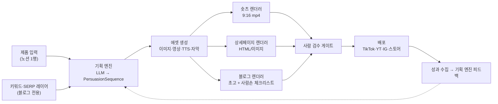
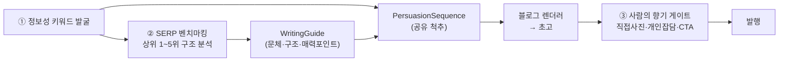
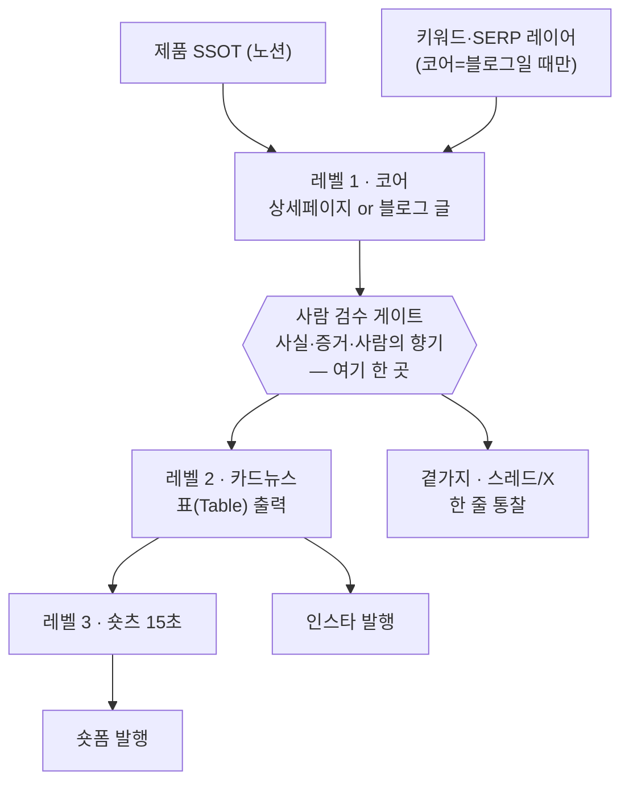
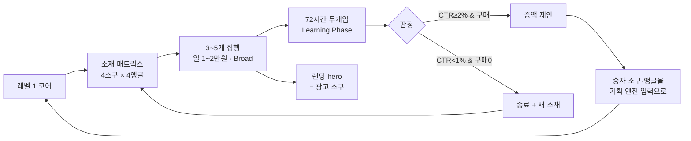

# AI 자동 숏츠·컨텐츠 생성 환경 — 설계 구상 (v0.1 Draft)

> 입력: [`01-detail-page-pas-framework.md`](./01-detail-page-pas-framework.md) (6단계 설득 논리)
> 상태: **Draft** — 12절 열린 질문이 확정되면 PRD로 승격한다.
> 작성일: 2026-08-31

---

## 1. 이 설계의 핵심 판단

**6단계 PAS는 "상세페이지 포맷"이 아니라 "설득 시퀀스 데이터 구조"다.**

상세페이지와 숏츠는 같은 6단계를 **다른 축**에 펼친 것뿐이다.

| | 상세페이지 | 숏츠 | 블로그 |
|---|-----------|------|-------|
| 축 | 스크롤(공간) | **시간 — 총 15초 3단** | 읽기 순서(스크롤) |
| 1 훅 | 최상단 GIF | **훅 0~3초** (이탈 방지) | 제목 + 첫 문장 |
| 2 공감 | 1스크롤 | 훅에 흡수 | 서론 (경험담) |
| 3 해결책 | 2스크롤 | **본론 3~12초** (설득) | 본문 → 해결책 |
| 4 증거 | 3스크롤 | 본론 — 자막·배지로 축약 | 직접 써본 후기·사진 |
| 5 혜택 | 4스크롤 | 본론 후반 — Before/After | The Bridge (제품 침투) |
| 6 행동 | 하단 고정 CTA | **CTA 12~15초** (전환) | 내부 링크 (정보 연장선) |

→ 기획을 채널 수만큼 반복하지 않는 것이 이 시스템의 존재 이유다.
채널별로 따로 만들면 메시지가 갈라지고 자동화 이득의 절반이 사라진다.

**하지만 채널을 병렬로 두면 안 된다.** 채널들은 **계층(폭포수)** 을 이룬다 —
정보량이 가장 많은 **코어 하나를 제대로 만들고, 거기서 아래로 압축해 내려보낸다**(7절).
작은 콘텐츠를 크게 만드는 건 어렵지만 큰 콘텐츠를 작게 쪼개는 건 쉽기 때문이다.

채널마다 **접는 방식**이 다르다.
- 블로그는 **방향이 반대(Pull)** 라서 앞뒤에 레이어가 하나씩 더 붙는다 → 5절.
- 숏츠는 **15초 3단으로 압축**해야 해서 6단계를 그대로 펼치지 못한다 → 6절.
- 카드뉴스·스레드는 **코어에서 파생**되며 독립 생성하지 않는다 → 7절.



---

## 2. 데이터 모델 — 시스템의 척추

모든 단계가 이 한 타입을 읽고 쓴다. 여기가 흔들리면 전부 흔들린다.

```ts
// src/lib/persuasion/types.ts

export type StageKind =
  | "HOOK" | "EMPATHY" | "SOLUTION" | "PROOF" | "BENEFIT" | "ACTION";

/** 비주얼 슬롯 — "무엇을 보여줄지"의 선언. 실제 파일은 asset이 채운다 */
export interface VisualSlot {
  /** AI에게 줄 장면 지시. 제품 실물이 필요하면 referenceImageIds를 채운다 */
  prompt: string;
  kind: "IMAGE" | "VIDEO" | "GIF" | "TEMPLATE";
  /** 제품 실물 참조 이미지(3·5단계 필수) */
  referenceImageIds: string[];
  /** 생성 결과. null이면 미생성 */
  asset: GeneratedAsset | null;
  /** true면 AI 생성 금지 — 사람이 실제 자료를 넣어야 하는 슬롯(4단계) */
  humanRequired: boolean;
}

export interface Stage {
  kind: StageKind;
  /** 숏츠 자막 = 상세페이지 헤드카피. 같은 문장을 공유한다 */
  copy: string;
  /** 내레이션 원고(숏츠 전용). null이면 자막만 */
  narration: string | null;
  visual: VisualSlot;
  /** 숏츠에서의 노출 길이(초) */
  durationSec: number;
}

export interface PersuasionSequence {
  id: string;
  productId: string;
  /** 같은 제품에 대한 A/B 변형 식별자 */
  variant: string;
  stages: Stage[];          // 길이 6, kind 순서 고정
  meta: {
    hookScore: number | null;   // 사전 예측 점수
    totalSec: number;
    createdAt: string;
  };
  /** 검수 상태 — 사람 승인 없이는 배포 불가 */
  review: "DRAFT" | "READY" | "APPROVED" | "REJECTED";
}
```

**불변식 3가지**

1. `stages`는 항상 6개, `HOOK → ACTION` 순서 고정. 단계를 건너뛴 시퀀스는 만들지 않는다.
2. `PROOF` 단계의 `visual.humanRequired`는 **항상 `true`**. 리뷰·인증·판매량을
   AI가 지어내면 그건 자동화가 아니라 허위광고다(13절 참조).
3. 배포 함수는 `review === "APPROVED"`가 아니면 **입력을 받지 않는다**(타입 레벨로 강제).

---

## 3. 파이프라인 5단계

### 3.1 입력 — 제품 SSOT

이 저장소는 이미 **노션을 SSOT로 두고 앱은 읽기만 한다**는 패턴을 쓰고 있다
(`docs/PRD.md`). 같은 패턴을 재사용한다: 노션 `제품` DB 1행 = 캠페인 1건.

| 노션 속성 | 용도 | 필수 |
|----------|------|:---:|
| 제품명 / 카테고리 | 기획 프롬프트 | ✅ |
| 핵심 스펙(숫자 차별점) | 3단계 카피 ("120g의 가벼움") | ✅ |
| 타깃 페르소나 | 2단계 장면 생성 | ✅ |
| 사용 맥락 2~3개 | 5단계 컷 ("사무실", "캠핑장") | ✅ |
| 제품 실물 사진 | 3·5단계 이미지 참조 | ✅ |
| **누적 판매량·리뷰·인증** | **4단계 (사람 입력)** | ✅ |
| 오퍼(할인율·마감·보장) | 6단계 | ✅ |

> 입력이 부실하면 결과가 부실하다. **입력 검증을 파이프라인 첫 게이트로 둔다** —
> 필수 7항목 중 하나라도 비면 생성을 시작하지 않고 어떤 칸이 비었는지 알려준다.
> (기존 저장소의 `warnings[]` 패턴과 동일한 사상)

### 3.2 기획 엔진 — LLM 1회 호출로 6단계 전체

- **프롬프트에 6단계 프레임워크 전문을 넣는다**(01 문서가 곧 시스템 프롬프트의 재료).
- 출력은 자유 텍스트가 아니라 **`PersuasionSequence` 스키마 강제**(structured output).
- 단계별로 나눠 호출하지 않는다 — 훅과 해결책이 서로를 모르면 메시지가 갈라진다.
- **훅 변형은 4가지 바이럴 공식 각 1개씩** 뽑는다(6.1). 숏츠는 훅에서 승부가 나므로
  A/B 대상은 사실상 1단계다. 단 **고르는 주체는 사람이 아니라 시장**이다 — 8.2 참조.

### 3.3 에셋 생성 — 이 환경에서 실제로 쓸 수 있는 도구

이 세션에는 미디어 생성 MCP 서버가 붙어 있다. 설계상 다음으로 매핑한다.

| 슬롯 | 도구 | 비고 |
|------|------|------|
| 이미지(2·3·5단계) | `generate_image` / `generate_image_batch` | 배치로 병렬 생성 |
| 영상 클립 | `generate_video` / `generate_video_batch` | 훅 GIF, 사용 맥락 컷 |
| 내레이션 | `generate_audio`, `list_voices` / `create_voice` | 브랜드 보이스 고정 |
| 숏츠 조립 | `shorts_studio_create` (+ `shorts_studio_create_preset`) | 프리셋 = 브랜드 템플릿 |
| 훅 사전 평가 | `virality_predictor` | 3변형 중 선택 근거 |
| 배포 | `tiktok_prepare_publish` / `tiktok_publish` | YT/IG는 별도 확인 필요 |
| 후처리 | `reframe`, `upscale_video`, `remove_background`, `outpaint_image` | 9:16↔1:1 재활용 |

> ⚠️ **검증 필요**: 위 도구들의 정확한 파라미터·비용·큐 동작은 실제 호출 전
> `models_explore` / `get_workflow_instructions`로 확인한다. 학습 데이터로 단정하지 않는다
> (`AGENTS.md` 원칙을 외부 API에도 동일 적용).

**설계 규칙**

- 에셋 생성은 **비동기 잡**이다. 요청-응답 안에서 기다리지 않는다.
  잡 상태를 `PersuasionSequence`에 물려 두고 폴링/웹훅으로 채운다.
- **캐릭터·보이스 일관성**이 브랜드 자산이다. 인물 컷은 캐릭터 시트를 먼저 만들어
  참조로 재사용한다(`character-sheet` 워크플로).
- 실패한 슬롯 1개 때문에 전체를 재생성하지 않는다. **슬롯 단위 재시도**.

### 3.4 렌더러 2종

| | 숏츠 렌더러 | 상세페이지 렌더러 |
|---|-----------|-----------------|
| 산출물 | 9:16 mp4 + 자막 + BGM | HTML(또는 단일 세로 이미지) |
| 구현 | `shorts_studio_create` 프리셋 | **이 저장소 스택 그대로** — Next 16 서버 컴포넌트 + Tailwind v4 |
| 재사용 | — | 인쇄 CSS 패턴처럼 `globals.css`에 상세페이지 전용 규칙 |
| 주의 | **총 15초·훅 3초 상한**(6.2 불변식). 첫 1초 안에 훅 자막 노출 | 스토어 업로드용 이미지 변환 경로 필요 |

> 상세페이지 렌더러는 **새 인프라가 필요 없다.** 이 저장소가 이미 Next 16 + Tailwind v4 +
> Base UI를 갖고 있으므로 `src/app/p/[productId]/preview` 같은 라우트 하나면 된다.
> (Base UI는 `asChild`가 없고 `render` prop을 쓴다 — `CLAUDE.md` 규약)

### 3.5 검수 게이트 → 배포

- 사람이 6단계를 **한 화면에서 훑고 승인**한다. 단계별 재생성 버튼 포함.
- 승인 없이 배포 API에 도달할 수 없게 한다(2절 불변식 3).
- 배포 후 성과(조회수·시청 지속률·전환)를 다시 노션에 적어 **다음 기획의 입력**으로 쓴다.
  이 루프가 없으면 그냥 생성기이고, 있으면 시스템이 된다.

---

## 4. 이 저장소에서의 배치안

```
src/
  lib/
    persuasion/
      types.ts          # PersuasionSequence 등 (2절)
      planner.ts        # LLM 기획 엔진 (server-only)
      prompts/           # 6단계 시스템 프롬프트
    media/
      jobs.ts           # 비동기 생성 잡 큐/폴링 (server-only)
      providers/         # MCP·API 어댑터 (교체 가능하게 격리)
    notion/              # 기존 모듈 재사용 (제품 SSOT)
  app/
    (app)/dashboard/campaigns/     # 캠페인 목록·검수 화면
    (app)/dashboard/campaigns/[id]/
    p/[productId]/preview/         # 상세페이지 렌더 (라우트 그룹 밖)
```

**저장소 규약 준수 체크**

| 규약 | 적용 |
|------|------|
| `nav-config.ts` 불변식 | `mainNav`에 "캠페인" 추가 시 `page.tsx` + `routeLabels` **동시** 추가 |
| Tailwind v4 설정 파일 없음 | 상세페이지 전용 CSS도 `src/app/globals.css` |
| Base UI (`render` prop) | `asChild` 금지 |
| `server-only` 경계 | 미디어·LLM API 키가 클라이언트로 새지 않도록 `lib/media`·`lib/persuasion` 최상단에 `import "server-only";` |
| `middleware.ts` 아님 | 게이트는 `src/proxy.ts` |
| `cacheComponents` 미설정 | `use cache` 금지, `unstable_cache` / `revalidateTag` 사용 |
| 테스트 러너 없음 | 타입 검증은 `npm run build`(dev 서버 끈 상태) |

---

## 5. 블로그 채널 — 모양이 다른 파이프라인

블로그를 3번째 렌더러로 끼워 넣으면 안 된다. **방향이 반대이기 때문이다.**

| | 상세페이지 · 숏츠 | 블로그 |
|---|-----------------|-------|
| 방향 | **Push** — 제품에서 출발해 고객에게 간다 | **Pull** — 고객의 검색 의도에서 출발해 제품으로 온다 |
| 시작점 | 제품 정보 | **정보성 고민 키워드** |
| 성공 판정 | 시청 지속·전환 | 검색 노출(C-Rank·DIA) → 체류 → 클릭 |
| AI 이미지 | **권장** | **최소화** (아래 5.3) |
| 발행 | 승인 후 그대로 | **AI 초고를 사람이 10% 고쳐야 발행 가능** |

그래도 **척추는 공유한다.** 블로그 5단계 작성 워크플로를 뜯어보면 PAS와 정확히 겹친다.

| 블로그 5단계 | `PersuasionSequence` 대응 |
|-------------|--------------------------|
| 서론 (경험담·공감) | `HOOK` + `EMPATHY` |
| 본문 (기존 방식의 단점) | `EMPATHY` (Agitation) |
| 해결책 (책상용 아이템) | `SOLUTION` |
| **제품 침투 (The Bridge)** | `SOLUTION` → `BENEFIT` (사용자 경험 중심) |
| 내부 링크 CTA | `ACTION` (단, "사러 가기" 금지 → 정보 연장선) |

→ **결론: 시퀀스는 그대로 쓰고, 앞뒤에 레이어를 하나씩 붙인다.**



### 5.1 앞단 — 키워드·벤치마킹 레이어

**정보성 키워드 발굴**은 LLM 1회 호출로 끝난다(03 문서 4절 프롬프트가 그대로 시스템 프롬프트).
입력은 이미 노션 제품 SSOT에 있는 `타깃 페르소나`뿐이므로 새 입력이 없다.

**벤치마킹**은 자동화 난이도가 갈린다.

| 방식 | 내용 | 판단 |
|------|------|------|
| 수동 | 사람이 상위 5개 글을 열어 본문을 붙여넣음 | **초기 채택.** 주 1~2회면 충분하고, 0일 구축 |
| 반자동 | 검색 결과 URL만 수집 → 사람이 확인 → 본문 추출 | 2단계 |
| 완전자동 | 크롤러로 SERP·본문 수집 | **보류** — 플랫폼 약관·robots 확인 필요, 이득 대비 위험 큼 |

> ⚠️ **벤치마킹 입력은 타인의 저작물이다.** 구조·톤·논리 흐름 **분석에만** 쓰고 문장을 재사용하지
> 않는다. 시스템은 **원문을 저장하지 않고** 분석 결과(`WritingGuide`)만 남긴다 — 저장하지 않으면
> 표절 경로 자체가 생기지 않는다.

```ts
// src/lib/persuasion/blog-types.ts

/** 상위 노출 글 분석 결과. 원문은 저장하지 않는다 */
export interface WritingGuide {
  keyword: string;
  /** "해요체", "친근한 반말" 등 */
  tone: string;
  /** "경험담 → 실패담 → 3단계 해결책" */
  structure: string;
  /** 끝까지 읽히는 이유 3가지 */
  attractionPoints: [string, string, string];
  imagePattern: { count: number; placement: string };
  retentionDevices: string[];   // 동영상, 스티커, 중간 요약 등
  analyzedAt: string;
}

export type KeywordKind = "SALES" | "INFORMATIONAL";

export interface TargetKeyword {
  text: string;
  kind: KeywordKind;      // SALES면 경고 — 상위 노출 불가
  painContext: string;    // 어떤 '불편한 상황'에서 나온 검색인가
}
```

> **게이트**: `kind === "SALES"`인 키워드로는 글 생성을 시작하지 않고 경고한다.
> 초보자가 반드시 밟는 지뢰이므로 **시스템이 대신 밟아준다.**

### 5.2 본체 — 5단계를 5회 호출로 쪼갠다

"한 번에 길게 쓰면 내용이 겹친다"는 원문 지적은 그대로 구현 규칙이 된다.

1. 페르소나 + `WritingGuide` 주입 (system prompt)
2. 개요 생성 → 사람이 소제목만 훑고 통과
3. **섹션별로 나눠 호출** (서론 / 본론 / 해결책) — 이전 섹션을 컨텍스트로 넘기되 재작성 금지
4. The Bridge — 제품 침투. **여기만 별도 호출**로 분리한다(광고 톤이 튀는 지점이라 재생성이 잦다)
5. 제목 5개 생성 → 사람이 고름

### 5.3 뒷단 — '사람의 향기' 게이트 (이 설계의 핵심)

**AI 초고는 발행물이 아니다.** 파이프라인의 산출물 타입 자체를 그렇게 정의한다.

```ts
export interface BlogDraft {
  sequenceId: string;
  guide: WritingGuide;
  keyword: TargetKeyword;
  titleCandidates: string[];   // 5개
  sections: { heading: string; body: string }[];
  bridge: string;              // 4단계 제품 침투 문단
  cta: string;

  /** 세 칸이 전부 차기 전에는 발행 함수가 입력을 받지 않는다 */
  humanTouch: {
    ownPhotos: PhotoAsset[];       // 직접 찍은 사진 (최소 1장)
    personalAnecdote: string | null; // 서론의 개인 잡담 한두 줄
    ctaReviewed: boolean;          // "사러 가기" 아닌지 사람이 확인
  };
}

/** 발행 가능한 상태 — 타입 레벨로 게이트 */
export type PublishableDraft = BlogDraft & {
  humanTouch: { ownPhotos: [PhotoAsset, ...PhotoAsset[]];
                personalAnecdote: string;
                ctaReviewed: true };
};
```

**구현 함정 — EXIF를 날리면 안 된다.**
원문은 사진의 **메타데이터(위치·촬영 기기)가 신뢰도를 증명한다**고 본다. 그런데 대부분의
이미지 최적화 파이프라인(리사이즈·webp 변환·CDN)은 **EXIF를 기본으로 제거한다.**
직접 찍은 사진을 넣고도 이점을 통째로 날릴 수 있으므로, 블로그용 사진 경로는
**EXIF 보존을 명시적으로 켠다.**

> 단, EXIF에는 **GPS 좌표(집·사무실 위치)** 가 들어간다. 보존과 프라이버시가 충돌하므로
> **촬영 기기 정보는 남기고 GPS는 선택**하게 한다 — 기본값은 GPS 제거로 두는 쪽이 안전하다.
> (열린 질문 Q-8)

**앞선 설계와의 공통점**: 상세페이지 4단계 '증거'가 `humanRequired: true`였던 것과
블로그의 `humanTouch`는 **같은 사상**이다. 채널마다 **사람이 반드시 채우는 칸**이 있고,
그 칸은 UI에서 "선택 입력"이 아니라 **타입이 강제하는 필수 칸**이어야 한다.
자동화의 품질은 자동화하지 않기로 한 부분을 얼마나 지켜내느냐로 결정된다.

## 6. 숏츠 채널 — 6단계를 3단 15초로 압축

**앞선 v0.1의 숏츠 타임라인(30초·6단계 그대로)은 틀렸다.** 04 문서의 원문은
**15초 3단**(훅 0~3초 / 본론 3~12초 / CTA 12~15초)을 불변 공식으로 제시한다.
15초에 6단계를 그대로 넣으면 단계당 2.5초 — 아무것도 전달되지 않는다.

→ **숏츠 렌더러의 첫 번째 책임은 '압축'이다.** 시퀀스를 그대로 펼치는 게 아니라
6단계를 3단으로 접는다. 무엇을 버릴지가 곧 렌더러의 설계다.

| PAS 6단계 | 숏츠 3단 배치 | 압축 방식 |
|----------|--------------|----------|
| 1 훅 | **훅 0~3초** | 그대로. 4공식 중 1개 적용 |
| 2 공감 | 훅 후반 ~ 본론 진입 | 문제 제기 한 줄로 **흡수** |
| 3 해결책 | **본론 3~12초** | 시연이 중심 |
| 4 증거 | 본론 중 | 말로 하지 않고 **자막·배지 오버레이**로 축약 |
| 5 혜택 | 본론 후반 | **Before/After 컷** (= 공식 3 비주얼 쇼크와 동일 소재) |
| 6 행동 | **CTA 12~15초** | 그대로 |

> **버려지는 건 없고 눌린다.** 2·4단계는 별도 구간을 못 받고 다른 구간에 얹힌다.
> 이 압축표가 없으면 LLM이 매번 다르게 접어서 결과가 들쭉날쭉해진다 —
> **압축 규칙은 프롬프트가 아니라 코드에 둔다.**

### 6.1 훅 공식 4종 = A/B의 축

v0.1에서 "훅 변형 3개를 임의로 뽑는다"고 했던 부분을 **원칙 있는 4종**으로 교체한다.

```ts
// src/lib/persuasion/shorts-types.ts

export type HookFormula =
  | "NEGATIVE_CURIOSITY"   // 공식 1 부정적 호기심 — 청개구리 심리
  | "THE_SECRET"           // 공식 2 비밀 폭로 — 희소성
  | "VISUAL_SHOCK"         // 공식 3 비포&애프터 — 시각 처리 속도
  | "RELATABLE_QUESTION";  // 공식 4 공감형 질문 — 자기 지목
```

**생성 전략**: 한 시퀀스에서 **4공식 각 1개씩 훅 4종**을 뽑고, `virality_predictor`로
순위를 매겨 사람이 고른다. 임의 변형 3개보다 커버리지가 넓고, **왜 이 훅인지**를
설명할 수 있다.

**공식 적용 가능성 판정**은 제품 속성에서 나온다 — 변화가 눈에 안 보이는 제품에
`VISUAL_SHOCK`을 시키면 빈 껍데기가 나온다. 적용 불가 공식은 **생성 전에 걸러낸다.**

| 공식 | 필요한 제품 조건 |
|------|-----------------|
| `VISUAL_SHOCK` | Before/After가 **1초 안에 눈으로 구분**됨 |
| `RELATABLE_QUESTION` | 타깃 페르소나가 **뾰족함**(넓으면 아무도 안 멈춤) |
| `THE_SECRET` | 공개할 **노하우·사용법**이 실제로 존재 |
| `NEGATIVE_CURIOSITY` | 제약 없음 (기본값) |

### 6.2 대본 형식이 곧 잡 명세다

원문의 **"줄글이 아니라 화면 설명(Visual)과 오디오(Audio)가 분리된 방송 대본"** 은
문서 서식 취향이 아니라 **파이프라인 설계상 이득**이다.

```ts
export interface Shot {
  atSec: number;
  durationSec: number;
  visual: string;              // 화면 설명 → 그대로 영상/이미지 생성 프롬프트
  audio: string;               // 내레이션 → 그대로 TTS 입력
  onScreenText: string | null; // 자막·배지 오버레이
}

export interface ShortsScript {
  sequenceId: string;
  formula: HookFormula;
  totalSec: number;            // 기본 15
  hook: Shot[];                // 합계 ≤ 3초  ← 불변식
  retention: Shot[];           // 3~12초
  cta: Shot[];                 // 12~15초
  /** UGC 리뷰 스타일로 자사 제품을 홍보하면 필수 (6.4) */
  adDisclosure: string | null;
}
```

**Shot 한 줄 = 생성 잡 한 개.** `visual` → `generate_video`/`generate_image`,
`audio` → `generate_audio`. 대본이 완성된 순간 잡 목록이 완성되므로,
중간에 사람이 "이 장면 지시를 뭘로 바꾸지" 하고 번역할 단계가 사라진다.

**불변식**: `sum(hook.durationSec) <= 3`. 훅이 3초를 넘으면 렌더를 거부한다 —
원문이 0~3초를 **이탈 방지 구간**이라 부르는 이유가 여기다.

### 6.3 예산은 훅에 몰아준다

훅이 실패하면 나머지 12초는 아무도 안 본다. 12초가 아까워서 훅을 대충 만드는 게
가장 비싼 실수다. 따라서 **생성 예산(비용·재시도 횟수)의 절반을 0~3초에 배정**하고,
본론은 재사용 가능한 클립 풀에서 끌어 쓰는 쪽으로 설계한다.

### 6.4 UGC 반말 스타일의 대가 — 광고 표기

마스터 프롬프트의 `[영상 스타일] 친구에게 추천하는 UGC 리뷰 스타일의 반말 모드`는
**효과가 좋은 만큼 표시 의무가 따라온다.** 판매자가 자사 제품을 제3자 리뷰처럼
보이게 만드는 형식이므로, **광고임을 알 수 있게 표기**해야 한다
(경제적 이해관계 공개 — 한국은 표시광고법상 추천·보증 심사지침, 플랫폼별 광고 라벨도 별도).

→ 그래서 `adDisclosure`는 **선택 필드가 아니라, UGC 스타일이면 채워져야 배포되는 필드**다.
숏츠 자막·설명란 양쪽에 들어가도록 렌더러가 처리한다.

> ⚠️ **검증 필요**: 정확한 표기 문구·위치 요건은 플랫폼(틱톡/릴스/유튜브)과
> 공정위 지침 최신본을 확인한다. 지금 코드에 문구를 하드코딩하지 않는다.

## 7. OSMU 폭포수 — 채널은 병렬이 아니라 **계층**이다

**v0.1~v0.3의 "하나의 시퀀스 → 렌더러 여러 개(병렬)" 구조는 틀렸다.**
05 문서의 폭포수 모델이 더 정확하고, 이유가 분명하다.

> 작은 콘텐츠를 크게 만드는 것은 어렵지만, 큰 콘텐츠를 작게 쪼개는 것은 쉽다.

병렬 모델에서는 채널 3개가 **각자 얇은 입력(노션 제품 행)에서 살을 붙였다.**
그건 **팽창**이고, LLM이 팽창할 때 채우는 살은 상당 부분 지어낸 것이다.
폭포수 모델은 **한 번만 팽창하고(레벨 1), 나머지는 전부 압축**한다.

| | 병렬 (v0.3까지) | **폭포수 (v0.4)** |
|---|----------------|------------------|
| 각 채널의 입력 | 제품 SSOT(얇음) | **레벨 1 산출물(두꺼움)** |
| LLM이 하는 일 | 채널마다 팽창 | **한 번 팽창 + N번 압축** |
| 사실 검증 지점 | 채널 수만큼 | **1곳 (레벨 1)** |
| 채널 간 메시지 정합 | 기대할 뿐 | **구조적으로 보장** |
| 실패 지점 | 분산 | 코어 1곳에 집중(10절 R16) |

**결정적 이득은 검증 지점의 수렴이다.** 앞서 채널마다 걸어 둔 사람 게이트
(`humanRequired`·`humanTouch`·The Bridge 사실 확인)가 폭포수에서는 **레벨 1 한 곳으로 모인다.**
코어를 사람이 제대로 검수하면 아래로 흐르는 파생물은 **새로운 사실을 만들 기회가 없다** —
압축만 하기 때문이다.

### 7.1 계층과 코어 선택

| 레벨 | 매체 | 산출물 | 이 저장소의 렌더러 |
|:---:|------|--------|------------------|
| **1 코어** | 텍스트 100% | 블로그 포스팅 **또는** 상세페이지 | 5절(블로그) / 3.4절(상세페이지) |
| **2 마이크로** | 이미지 | 인스타 카드뉴스 3~5장 + 캡션 | **신규 — 7.2** |
| **3 나노** | 영상 | 숏츠·릴스·틱톡 15초 | 6절(3단 압축) |
| **(곁가지)** | 짧은 텍스트 | 스레드/X 한 줄 통찰 | **신규 — 채널 4** |

**코어는 캠페인 목적이 정한다.** 둘 다 "텍스트 100%·정보량 최대"라는 레벨 1 조건을 만족한다.

| 캠페인 목적 | 코어 | 방향 |
|------------|------|------|
| 판매 (제품을 알린다) | **상세페이지** | Push |
| 유입 (검색으로 만난다) | **블로그 글** | Pull |

> `Campaign.coreKind: "DETAIL_PAGE" | "BLOG_POST"` 하나로 갈라지고,
> 그 아래 파이프라인은 **완전히 동일**하다.



**역방향은 금지한다.** 숏츠에서 블로그를 만들 수 없다 — 없는 정보를 지어내야 하기 때문이다.
타입으로 강제할 수 있다: 파생 함수는 `level: N` 산출물을 받아 `level: N+1`만 반환한다.

### 7.2 레벨 2 — **출력 형식이 다음 도구의 입력 계약이다**

원문이 "표(Table) 형식으로 정리해줘"라고 지시하는 이유는 서식 취향이 아니다.
**캔바 대량 제작(Bulk Create)이 표를 먹기 때문이다.** 표 한 행 = 카드 한 장.

```ts
// src/lib/persuasion/osmu-types.ts

/** 캔바 Bulk Create의 열 계약. 한 행 = 카드 한 장 */
export interface CardRow {
  index: number;
  headline: string;      // 임팩트 있게
  body: string;          // 2줄 이내
  imagePrompt: string;   // 어떤 그림이 들어가야 할지
}

export interface MicroContent {
  sourceCoreId: string;  // 레벨 1 산출물 — 없으면 생성 불가
  cards: CardRow[];      // 3~5장 (원문 예시는 6장)
  caption: string;
  hashtags: string[];    // 15개
}
```

이 패턴은 이미 두 번 나왔다 — 숏츠의 `Shot` 한 줄 = 생성 잡 한 개, 카드뉴스의 표 한 행 =
카드 한 장. **파이프라인 접합부에서는 자유 텍스트를 주고받지 않는다.** 다음 단계 도구가
읽을 수 있는 행 단위 구조로 넘긴다. OSMU 자동화의 실제 난이도는 여기에 있지, 프롬프트에 있지 않다.

### 7.3 채널별 문법을 렌더러 판정 기준으로

| 채널 | 판정 기준 | 렌더러가 실제로 지켜야 할 것 |
|------|----------|---------------------------|
| 블로그 | **유용해야** | 정보 밀도. 길이는 죄가 아니다 |
| 인스타 | **예뻐야** | 카드당 텍스트 상한(본문 2줄). 넘으면 잘라내고 경고 |
| 숏폼 | **재밌어야** | 훅 3초 상한(6.2). 서론 금지 |
| 스레드/X | **짧아야** | 한 줄 통찰 1개. 요약이 아니라 **발췌된 문장** |

> 스레드/X는 **압축이 아니라 발췌**다. 요약하면 밍밍해진다 —
> 코어에서 가장 날 선 문장 하나를 **그대로 뽑아 오는** 편이 낫다.

### 7.4 외부 도구는 "반자동"이다 — 솔직하게

원문의 도구 체인(캔바 Bulk Create · 브루 · 런웨이 · 클링)은 **사람이 화면에서 조작하는 SaaS**다.
API 제공 여부·약관·요금이 제각각이므로, **지금 단계에서 완전 자동을 약속하지 않는다.**

| 구간 | 자동화 수준 | 이 저장소가 할 일 |
|------|-----------|-----------------|
| 코어 → 표(CardRow[]) | **완전 자동** | LLM 호출 + 스키마 검증 |
| 표 → 카드 이미지 | **반자동** | 캔바에 붙여 넣을 **CSV/TSV 내보내기**를 제공 |
| 카드 → 숏츠 대본 | **완전 자동** | 6절 `ShortsScript` 생성 |
| 대본 → 영상 | **자동 가능** | 이 환경의 미디어 MCP 도구로 대체 가능(3.3절) |
| 사진 → 시네마그래프 | **반자동** | 런웨이/클링은 수동. 대안은 `motion_control` 도구 |

> **브루의 "무료 영상 소스"는 그대로 쓰지 않는다.** 원문도 제품 이미지로 교체하라고 말한다.
> 제품과 무관한 스톡 영상이 붙으면 광고로서 무의미하고, **상업적 이용 라이선스 범위도
> 확인이 필요**하다(U-15). 자동화한다면 **스톡 클립 자동 교체를 기본 동작**으로 둔다.

### 7.5 '슈퍼 프롬프트'는 사람용이다 — 시스템은 쪼갠다

원문은 4개 채널을 **한 번에** 주문하는 슈퍼 프롬프트를 권한다. 손으로 쓸 때는 맞다.
하지만 시스템에 넣을 때는 **채널별 분할 호출**이 낫다.

- 한 응답에 4채널을 담으면 뒤쪽 채널의 품질이 떨어진다(블로그 5단계에서 "한 번에 길게 쓰면
  내용이 겹친다"고 한 것과 같은 현상).
- 한 채널이 실패하면 **전체가 재생성**된다. 앞서 세운 슬롯 단위 재시도 원칙과 충돌한다.
- 코어(소스)는 4번 다 같으므로 **프롬프트 캐싱으로 비용 이득을 회수**할 수 있다.

→ **슈퍼 프롬프트의 내용은 살리되, 호출은 쪼갠다.** 채널별 지시문을 한 파일에 모아
단일 진실원본으로 관리하고(`prompts/osmu/*.ts`), 실행만 분리한다.

## 8. 광고 소재 — 예측이 아니라 **대응**

지금까지의 설계에는 구멍이 하나 있었다. 3.5절의 "성과 수집 → 기획 엔진 피드백"이
**화살표 하나로만 존재했다.** 06 문서가 그 화살표의 내용을 채운다.

> 10년 차 마케터도, 사장도, 심지어 AI도 모른다. 오직 시장의 '고객' 반응만이 정답을 안다.

### 8.1 소재는 조합이다 — 두 축을 타입으로

```ts
// src/lib/persuasion/ad-types.ts

/** 카피 축 — 심리 소구 4종 */
export type AppealType =
  | "FEAR"        // 공포 소구: 안 썼을 때의 위험성
  | "BANDWAGON"   // 사회적 증거: 대세감
  | "URGENCY"     // 파격 혜택: 지금 아니면 손해
  | "CURIOSITY";  // 호기심 유발: 의문문

/** 이미지 축 — 시각 앵글 4종 */
export type CreativeAngle =
  | "PRODUCT_CLEAN"    // 제품 중심, 배경 삭제
  | "MODEL"            // 모델 중심, 페이스 스왑
  | "UGC_NATIVE"       // 일반인이 폰으로 찍은 듯 (투박할수록 CTR ↑)
  | "TEXT_THUMBNAIL";  // 텍스트가 큼지막한 정보성 섬네일

export interface AdCreative {
  id: string;
  campaignId: string;
  appeal: AppealType;
  angle: CreativeAngle;
  copy: string;
  imageAssetId: string;
  /** 클릭 후 도착할 랜딩 변형 — 8.4 메시지 매칭 */
  landingVariant: AppealType;
  status: "DRAFT" | "RUNNING" | "WINNER" | "LOSER";
}
```

**4 소구 × 4 앵글 = 16 축**이 후보 풀이고, 한 번에 집행하는 건 3~5개다.
**매트릭스는 풀이고 집행은 표본**이라는 점을 코드가 알아야 한다 —
16개를 다 켜면 예산이 쪼개져 어느 것도 학습 구간을 못 넘긴다.

**비용 구조가 비대칭이다.** 카피 20~100개는 LLM 1회 호출로 거의 공짜지만
이미지 40장은 비싸다. → **카피는 넉넉히, 이미지는 앵글당 소수를 만들어 조합으로 다양성을 낸다.**

### 8.2 예측을 약화시킨다 — 6.1절 정정

6.1절에서 "훅 4공식을 뽑아 `virality_predictor`로 순위를 매겨 **사람이 고른다**"고 했다.
06 문서의 원칙과 충돌한다. **골라내는 순간 회의실로 돌아간다.**

정정: **예측은 사전 필터일 뿐, 판정은 시장이 한다.**

| 채널 | 다 던지는가 | 이유 |
|------|:---------:|------|
| **유료 광고** | **던진다** | 예산이 곧 필터다. 못 쓰는 소재는 3일 만에 돈으로 걸러진다 |
| **오가닉** (블로그·계정 피드) | **고른다** | 계정에 누적된다. 저품질 글·스팸성 도배는 **계정 자체를 깎아먹는다** |

> 이 구분이 없으면 "다 던져라"를 블로그에 적용해 계정을 망친다.
> 06 문서의 속도전은 **돈으로 검증을 사는 유료 지면의 논리**다.

### 8.3 A/B는 규칙이지 감이 아니다

원문의 판정 규칙을 그대로 코드로 옮긴다. **사람이 3일 전에 손대는 것을 막는 게 핵심**이다.

```ts
export interface AdResult {
  creativeId: string;
  impressions: number;
  clicks: number;
  purchases: number;
  spend: number;
  startedAt: string;
}

/** 학습 구간이 끝나기 전에는 판정하지 않는다 */
export const LEARNING_PHASE_HOURS = 72;

export type Verdict = "LEARNING" | "WINNER" | "LOSER" | "HOLD";
```

| 판정 | 조건 | 자동 대응 |
|------|------|----------|
| `LEARNING` | 집행 후 72시간 미만 | **아무것도 하지 않는다.** UI에서 조작 버튼을 잠근다 |
| `WINNER` | CTR ≥ 2% **AND** 구매 ≥ 1 | 예산 증액 제안 |
| `LOSER` | CTR < 1% **AND** 구매 = 0 | 종료 제안 + 새 소재 투입 |
| `HOLD` | 그 사이 | 유지, 다음 주기에 재평가 |

> ⚠️ **CTR 2%/1%는 원문에 근거가 없다**(U-19). 플랫폼·업종·지면에 따라 크게 다르므로
> **초기값으로만 쓰고 자사 데이터가 20~30건 쌓이면 재보정**한다. 상수는 설정으로 뺀다.

**시스템이 하는 일은 판정과 제안까지고, 예산 증액·종료 실행은 사람이 누른다.**
광고비는 돈이 나가는 되돌릴 수 없는 행동이라 자동 집행을 기본값으로 두지 않는다.

### 8.4 메시지 매칭 — 폭포수와 충돌하는가

**언뜻 충돌해 보인다.** 폭포수는 코어 → 파생 한 방향인데, 메시지 매칭은
"광고 카피에 맞춰 **상세페이지 최상단을 바꾸라**"고 한다. 역방향 아닌가?

아니다. **코어는 하나이고, 진입 소구에 따라 hero 블록만 갈아 끼운다.**

```
                    ┌─ ?appeal=fear      → hero: "세균 99.9% 박멸"
코어 상세페이지 ────┼─ ?appeal=urgency   → hero: "1+1 진행 중 (남은 시간 03:00)"
(본문은 동일)       ├─ ?appeal=bandwagon → hero: "리뷰 5,000개"
                    └─ ?appeal=curiosity → hero: "입 냄새의 진짜 원인"
```

정보는 여전히 **코어에서만 나온다.** hero는 코어에 이미 있는 내용을 **어느 것부터 보여줄지**
고르는 것이지 새로 만드는 게 아니다. 폭포수 위반이 아니라 **같은 코어의 조건부 렌더**다.

**구현 함정(이 저장소 스택)**: `searchParams`를 읽으면 라우트가 **동적 렌더**가 된다.
공개 뷰 ISR 캐시가 통째로 날아가는 것은 `docs/PRD.md` 10.3의 함정 2와 정확히 같은 사고다.
→ **hero만 분기하고 본문은 캐시**되도록 컴포넌트 경계를 나눈다. 소구가 4종으로 유한하므로
`generateStaticParams` 계열로 **경로 분기(`/p/[id]/[appeal]`)** 를 두는 편이 더 안전하다.

**카운트다운 타이머는 실제 마감과 연결한다.** 광고가 "오늘만"이라고 했으면 상세페이지
타이머도 같은 시각에 끝나야 한다. 서로 다른 값을 각자 들고 있으면 언젠가 어긋나고,
어긋난 긴급성은 그냥 거짓말이다(10절 R21).

### 8.5 피드백 루프가 닫힌다



**승자 데이터가 돌아오는 곳은 소재 생성기가 아니라 기획 엔진이다.**
"이 제품은 공포 소구가 먹힌다"는 사실이 확인되면 다음 코어의 PAS 2단계(공감)와
숏츠 훅 공식 선택까지 바뀐다. 광고가 **가장 빠른 검증 지면**인 이유다 —
블로그는 2주, 광고는 3일이면 답이 나온다.

## 9. 단계별 구축 순서

의존성 순서다. 각 단계는 **버릴 수 없는 검증 산출물**을 하나씩 남긴다.

| 단계 | 내용 | 검증 산출물 | 예상 |
|:---:|------|------------|------|
| **S1** | 제품 입력 스키마 + 기획 엔진만 | 제품 1건 → `PersuasionSequence` JSON 콘솔 출력. 사람이 읽고 "이 6단계면 팔리겠다" 판정 | 2일 |
| **S2** | 에셋 생성 1슬롯 실측 | 3단계 제품 컷 1장을 실제 도구로 생성. **비용·소요시간 실측치 기록** | 1~2일 |
| **S3** | 숏츠 1편 수동 조립 | **15초 mp4 1편**(훅 3초 지킴, 4공식 중 1개 적용). 자동화 전에 **손으로 한 편을 완주**해야 무엇을 자동화할지 안다 | 2일 |
| **S4** | 파이프라인 자동화 + 검수 화면 | 노션 1행 → 검수 대기 상태의 숏츠 1편 (버튼 1회) | 4~5일 |
| **S5** | 상세페이지 렌더러 | 같은 시퀀스로 상세페이지 산출 | 2~3일 |
| **S6** | 배포 + 성과 피드백 루프 | 실제 업로드 1건 + 성과 수치 노션 기록 | 2~3일 |

> **S3를 건너뛰지 않는다.** 숏츠 자동화 프로젝트가 실패하는 가장 흔한 이유는
> "사람이 만족할 만한 한 편"의 기준을 정하기 전에 파이프라인부터 짜는 것이다.

### 블로그 트랙 (B1~B3)

블로그는 **영상 파이프라인과 의존 관계가 없다.** S1(기획 엔진)만 공유하므로
S2~S4와 **병렬로 진행 가능**하고, 미디어 생성 비용·잡 큐가 필요 없어 **더 싸고 빠르다.**
자금·시간이 빠듯하면 **블로그를 먼저 굴려 검증하는 편이 합리적이다.**

| 단계 | 내용 | 검증 산출물 | 예상 |
|:---:|------|------------|------|
| **B1** | 키워드 발굴 + SERP 벤치마킹(수동 입력) | 정보성 키워드 10개 + `WritingGuide` 1건 | 1일 |
| **B2** | 5단계 분할 호출로 초고 생성 | 사람이 읽고 "이 정도면 손 좀 보고 올리겠다" 판정되는 초고 1편 | 2일 |
| **B3** | 사람의 향기 게이트 + 발행 체크리스트 | 실제 발행 1건 + **2주 후 검색 노출 순위 기록** | 2일 |

> B3의 검증은 **2주를 기다려야 나온다.** 검색 노출은 즉시 확인되지 않으므로
> B3를 일찍 시작해 놓고 그 사이에 영상 트랙을 진행하는 것이 일정상 유리하다.

---

## 10. 비용·성능에서 미리 정할 것

| 항목 | 판단 |
|------|------|
| 1편당 생성 비용 | S2에서 실측. **편당 상한선을 코드에 박는다**(초과 시 중단) |
| 소요 시간 | 영상 생성이 병목. 6슬롯 병렬(batch) 전제 |
| 재생성 비용 | 슬롯 단위 재시도로 전체 재생성 방지 |
| 에셋 보관 | 승인된 시퀀스의 에셋만 영구 보관, 폐기 변형은 정리 |

---

## 11. 리스크

| # | 리스크 | 완화 |
|---|--------|------|
| R1 | **4단계 증거를 AI가 지어냄** → 허위광고 | `humanRequired: true` 타입 강제 + 검수 화면에서 출처 필수 입력 |
| R2 | 생성 이미지의 제품이 실물과 다름 | 실물 참조 이미지 필수, 3단계는 참조 없으면 생성 거부 |
| R3 | 6편이 전부 똑같아 보임(템플릿 피로) | 훅 변형 3종 + 프리셋 복수 운영, 성과 피드백으로 도태 |
| R4 | 외부 미디어 API 스펙·요금 변경 | `lib/media/providers/`로 어댑터 격리, 한 곳만 고치면 되게 |
| R5 | 플랫폼 정책(AI 생성물 표기 의무) 위반 | 배포 시 AI 생성 라벨 자동 부착. **플랫폼별 최신 정책 확인 필요** |
| R6 | 승인 없이 자동 업로드되어 사고 | 배포 함수 입력 타입을 `ApprovedSequence`로 제한 |
| R7 | 초상권·상표권 (실존 인물풍 이미지) | 캐릭터 시트를 자체 생성해 고정, 실존 인물 프롬프트 금지 |
| R8 | **AI 초고를 그대로 발행 → 저품질 분류** (네이버 독창성 로직) | `PublishableDraft` 타입 게이트(5.3). 사람 손 3칸이 비면 발행 함수 호출 불가 |
| R9 | **벤치마킹 원문이 초고에 새어 들어가 표절** | 원문 미저장 · `WritingGuide`(구조·톤만)로 축약해 전달 · 초고 유사도 육안 확인 |
| R10 | 이미지 최적화가 **EXIF를 제거**해 '직접 찍은 사진'의 이점 소실 | 블로그 사진 경로만 EXIF 보존 켬. 단 GPS는 기본 제거(Q-8) |
| R11 | 판매 키워드로 글을 써서 노출 0 | 키워드 `kind === "SALES"`면 생성 자체를 차단하고 경고(5.1) |
| R12 | **15초에 6단계를 욱여넣어 아무것도 전달 안 됨** | 압축표를 코드에 고정(6절). 훅 3초 상한을 렌더 차단 조건으로 |
| R13 | **UGC 반말 리뷰 형식인데 광고 표기 누락** | `adDisclosure`를 배포 전제 필드로(6.4). 문구는 최신 지침 확인 후 주입 |
| R14 | 훅이 **검증 불가한 사실을 주장**("○○업계가 이 영상을 싫어합니다") | 도발적 표현은 허용하되 **사실 주장 문장은 사람 검수 필수 항목**으로 분리 |
| R15 | 제품에 안 맞는 훅 공식 적용(변화가 안 보이는데 비주얼 쇼크) | 제품 조건표로 **생성 전 필터링**(6.1) |
| R16 | **폭포수의 단일 실패점** — 코어가 틀리면 전 채널이 틀린다 | 이게 폭포수의 대가다. 대신 검수를 **코어 1곳에 몰아** 깊게 한다. 파생물은 압축만 하므로 새 오류를 못 만든다 |
| R17 | 캔바·브루·런웨이가 **수동 SaaS**라 "완전 자동" 약속이 깨짐 | 구간별 자동화 수준을 명시(7.4). 표는 **CSV 내보내기**까지만 책임 |
| R18 | 브루가 붙인 **스톡 영상의 상업적 이용 범위** 미확인 | 스톡 클립 **자동 교체를 기본 동작**으로. 라이선스는 사용 전 확인(U-15) |
| R19 | **"다 던져라"를 오가닉 채널에 적용**해 계정 품질을 깎아먹음 | 유료/오가닉 분리(8.2). 오가닉은 골라서 발행 |
| R20 | CTR 2%/1% 기준을 **근거 없이 신뢰** | 초기값으로만 사용, 자사 데이터 20~30건에서 재보정(8.3, U-19) |
| R21 | 광고 카피와 랜딩 타이머·문구가 **어긋남** | 마감 시각·오퍼를 코어에 단일 보관하고 양쪽이 같은 값을 읽는다(8.4) |
| R22 | **효능·수치 주장에 근거 없음** ("세균 99.9% 박멸", "변기보다 더러운") | 실증 자료가 있는 문구만 사용. 근거 없는 수치는 소재 생성 단계에서 차단 |
| R23 | 반복되는 "오늘만" **거짓 긴급성** | 오퍼 마감은 실제 마감과 연결. 연장하려면 오퍼를 새로 만든다 |
| R24 | 랜딩 `searchParams` 분기로 **ISR 캐시 전면 소실** | hero만 분기하고 본문은 캐시. 소구가 유한하므로 경로 분기 권장(8.4) |

---

## 12. 열린 질문 (진행 전 확정 필요)

| # | 질문 | 왜 지금 필요한가 |
|---|------|-----------------|
| Q-1 | **어떤 제품/카테고리로 시작하는가?** (책 예시의 휴대용 선풍기? 실제 판매 제품?) | 입력 스키마와 프롬프트가 여기서 갈린다 |
| Q-2 | 배포 채널 우선순위 — TikTok / YouTube Shorts / Instagram Reels / 스마트스토어 | 렌더 규격·API 연동 범위 결정 |
| Q-3 | 숏츠와 상세페이지 중 **먼저 만들 것**은? | S3~S5 순서 |
| Q-4 | 제품 정보 SSOT를 **노션**으로 가는가, 앱 자체 입력 폼인가? | 기존 노션 모듈 재사용 여부 |
| Q-5 | 내레이션(TTS)을 쓰는가, 자막만인가? | 오디오 파이프라인 유무 |
| Q-6 | 1편당 허용 비용·목표 제작 편수(주당 몇 편?) | 배치 설계와 상한선 |
| Q-7 | 검수는 항상 사람이 하는가, 일정 조건에서 자동 배포도 허용하는가? | 게이트 설계 (권장: **항상 사람**) |
| Q-8 | 블로그 사진의 **EXIF GPS를 남기는가?** (신뢰도 ↑ vs 집·사무실 위치 노출) | 이미지 처리 경로 기본값 (권장: **기기 정보만 남기고 GPS 제거**) |
| Q-9 | 블로그 플랫폼은? (네이버 / 티스토리 / 자체 도메인) | C-Rank·DIA는 **네이버 전제**다. 플랫폼이 다르면 5절 전체가 바뀐다 |
| Q-10 | **영상 트랙과 블로그 트랙 중 무엇을 먼저 굴리는가?** | 9절 순서. 블로그가 더 싸고 빠르지만 성과 확인에 2주 필요 |
| Q-11 | 숏츠 기본 길이를 **15초로 고정**하는가, 30·60초 변형도 두는가? | 압축표가 길이마다 달라진다(6절) |
| Q-12 | **UGC 반말 페르소나를 브랜드 계정에서 쓸 것인가?** 아니면 별도 계정? | 계정 정체성 + 광고 표기 방식이 갈린다 |
| Q-13 | **코어를 무엇으로 두는가** — 상세페이지(판매) / 블로그 글(유입)? | `Campaign.coreKind`. 폭포수 전체의 출발점(7.1) |
| Q-14 | **스레드/X 채널을 운영하는가?** | 안 할 거면 곁가지 렌더러를 만들지 않는다 |
| Q-15 | 캔바·브루를 **API로 붙이는가, 수동으로 두는가?** | 7.4 자동화 수준. 수동이면 CSV 내보내기까지가 시스템 경계 |
| Q-16 | **광고 플랫폼은?** (메타 / 구글 / 네이버 GFA / 틱톡) | 성과 API·소재 규격·CTR 기준이 전부 다르다 |
| Q-17 | **일 광고 예산과 동시 집행 소재 수** | 원문은 1~2만원·3~5개. 소재가 많으면 학습 구간을 못 넘긴다(8.1) |
| Q-18 | 승자 판정 후 **증액·종료를 자동 실행하는가?** | 권장은 **제안까지만**. 광고비는 되돌릴 수 없다(8.3) |
| Q-19 | 랜딩 소구 변형을 **쿼리 파라미터 vs 경로**로? | 캐시 전략이 갈린다(8.4, R24) |

---

## 13. 지켜야 할 선

자동화 대상은 **표현**이지 **사실**이 아니다.

- 리뷰·판매량·인증·수상은 **실제 자료만** 쓴다. AI 생성 금지(R1).
- 효능 주장은 근거가 있는 범위에서만. 6단계 카피가 과장으로 흐르기 쉬운 구간이
  4단계(증거)와 6단계(긴급성)다 — **이 두 곳만 사람이 반드시 읽는다.**
- 플랫폼의 AI 생성물 표기 의무를 따른다(R5).
- **벤치마킹은 분석이지 복제가 아니다.** 남의 글에서 가져오는 것은 *구조와 톤*까지이고,
  문장은 가져오지 않는다(R9).
- **수치와 효능은 실증 자료가 있을 때만 쓴다.** "세균 99.9% 박멸" 같은 문장은
  시험 성적서가 뒷받침될 때의 표현이지, 카피라이팅으로 만들어낼 문장이 아니다(R22).
- **긴급성은 실제 마감과 연결한다.** 매일 "오늘만"이면 그건 할인이 아니라 거짓말이다(R23).
- **정보는 위에서 아래로만 흐른다.** 파생물이 코어에 없던 사실을 새로 만들어내면
  그건 압축이 아니라 날조다(7절).
- **훅의 도발과 허위는 다르다.** "사지 마세요"(반어)는 되고, "○○업계가 이 영상을
  싫어합니다"처럼 **확인할 수 없는 사실을 주장하는 문장**은 안 된다(R14).
- **UGC 리뷰 형식으로 자사 제품을 홍보하면 광고임을 밝힌다**(R13). 형식이 효과적인 이유가
  바로 "제3자처럼 보이는 것"이므로, 표기를 빼는 순간 그 효과는 기만이 된다.
- 블로그 후기는 **실제로 써본 뒤에 쓴다.** "직접 써보니 소음이 없더라"는 문장은
  써보지 않았다면 그냥 거짓말이다. The Bridge 문단은 사람이 사실 확인을 하고 통과시킨다.
