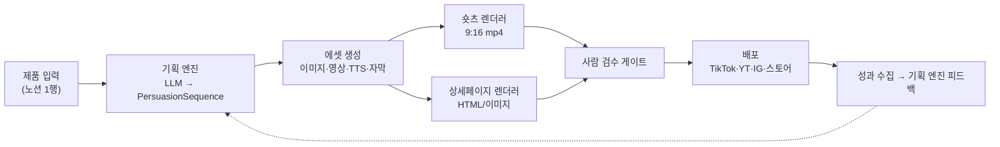

# AI 자동 숏츠·컨텐츠 생성 환경 — 설계 구상 (v0.1 Draft)

> 입력: [`01-detail-page-pas-framework.md`](./01-detail-page-pas-framework.md) (6단계 설득 논리)
> 상태: **Draft** — 8절 열린 질문이 확정되면 PRD로 승격한다.
> 작성일: 2026-08-31

---

## 1. 이 설계의 핵심 판단

**6단계 PAS는 "상세페이지 포맷"이 아니라 "설득 시퀀스 데이터 구조"다.**

상세페이지와 숏츠는 같은 6단계를 **다른 축**에 펼친 것뿐이다.

| | 상세페이지 | 숏츠 |
|---|-----------|------|
| 축 | 스크롤(공간) | 시간(초) |
| 1 훅 | 최상단 GIF | 0~2초 |
| 2 공감 | 1스크롤 | 2~6초 |
| 3 해결책 | 2스크롤 | 6~12초 |
| 4 증거 | 3스크롤 | 12~18초 |
| 5 혜택 | 4스크롤 | 18~26초 |
| 6 행동 | 하단 고정 CTA | 26~30초 |

→ **결론: 시퀀스를 한 번 만들고, 렌더러를 두 개 둔다.** 기획을 두 번 하지 않는 것이
이 시스템의 존재 이유다. 숏츠용과 상세페이지용을 따로 만들면 메시지가 갈라지고
자동화 이득의 절반이 사라진다.



---

## 2. 데이터 모델 — 시스템의 척추

모든 단계가 이 한 타입을 읽고 쓴다. 여기가 흔들리면 전부 흔들린다.

```ts
// src/lib/persuasion/types.ts

export type StageKind =
  | "HOOK" | "EMPATHY" | "SOLUTION" | "PROOF" | "BENEFIT" | "ACTION";

/** 비주얼 슬롯 — "무엇을 보여줄지"의 선언. 실제 파일은 asset이 채운다 */
export interface VisualSlot {
  /** AI에게 줄 장면 지시. 제품 실물이 필요하면 referenceImageIds를 채운다 */
  prompt: string;
  kind: "IMAGE" | "VIDEO" | "GIF" | "TEMPLATE";
  /** 제품 실물 참조 이미지(3·5단계 필수) */
  referenceImageIds: string[];
  /** 생성 결과. null이면 미생성 */
  asset: GeneratedAsset | null;
  /** true면 AI 생성 금지 — 사람이 실제 자료를 넣어야 하는 슬롯(4단계) */
  humanRequired: boolean;
}

export interface Stage {
  kind: StageKind;
  /** 숏츠 자막 = 상세페이지 헤드카피. 같은 문장을 공유한다 */
  copy: string;
  /** 내레이션 원고(숏츠 전용). null이면 자막만 */
  narration: string | null;
  visual: VisualSlot;
  /** 숏츠에서의 노출 길이(초) */
  durationSec: number;
}

export interface PersuasionSequence {
  id: string;
  productId: string;
  /** 같은 제품에 대한 A/B 변형 식별자 */
  variant: string;
  stages: Stage[];          // 길이 6, kind 순서 고정
  meta: {
    hookScore: number | null;   // 사전 예측 점수
    totalSec: number;
    createdAt: string;
  };
  /** 검수 상태 — 사람 승인 없이는 배포 불가 */
  review: "DRAFT" | "READY" | "APPROVED" | "REJECTED";
}
```

**불변식 3가지**

1. `stages`는 항상 6개, `HOOK → ACTION` 순서 고정. 단계를 건너뛴 시퀀스는 만들지 않는다.
2. `PROOF` 단계의 `visual.humanRequired`는 **항상 `true`**. 리뷰·인증·판매량을
   AI가 지어내면 그건 자동화가 아니라 허위광고다(9절 참조).
3. 배포 함수는 `review === "APPROVED"`가 아니면 **입력을 받지 않는다**(타입 레벨로 강제).

---

## 3. 파이프라인 5단계

### 3.1 입력 — 제품 SSOT

이 저장소는 이미 **노션을 SSOT로 두고 앱은 읽기만 한다**는 패턴을 쓰고 있다
(`docs/PRD.md`). 같은 패턴을 재사용한다: 노션 `제품` DB 1행 = 캠페인 1건.

| 노션 속성 | 용도 | 필수 |
|----------|------|:---:|
| 제품명 / 카테고리 | 기획 프롬프트 | ✅ |
| 핵심 스펙(숫자 차별점) | 3단계 카피 ("120g의 가벼움") | ✅ |
| 타깃 페르소나 | 2단계 장면 생성 | ✅ |
| 사용 맥락 2~3개 | 5단계 컷 ("사무실", "캠핑장") | ✅ |
| 제품 실물 사진 | 3·5단계 이미지 참조 | ✅ |
| **누적 판매량·리뷰·인증** | **4단계 (사람 입력)** | ✅ |
| 오퍼(할인율·마감·보장) | 6단계 | ✅ |

> 입력이 부실하면 결과가 부실하다. **입력 검증을 파이프라인 첫 게이트로 둔다** —
> 필수 7항목 중 하나라도 비면 생성을 시작하지 않고 어떤 칸이 비었는지 알려준다.
> (기존 저장소의 `warnings[]` 패턴과 동일한 사상)

### 3.2 기획 엔진 — LLM 1회 호출로 6단계 전체

- **프롬프트에 6단계 프레임워크 전문을 넣는다**(01 문서가 곧 시스템 프롬프트의 재료).
- 출력은 자유 텍스트가 아니라 **`PersuasionSequence` 스키마 강제**(structured output).
- 단계별로 나눠 호출하지 않는다 — 훅과 해결책이 서로를 모르면 메시지가 갈라진다.
- **변형 3개를 한 번에 뽑는다**(훅 각도만 다르게). 숏츠는 훅에서 승부가 나므로
  A/B 대상은 사실상 1단계다.

### 3.3 에셋 생성 — 이 환경에서 실제로 쓸 수 있는 도구

이 세션에는 미디어 생성 MCP 서버가 붙어 있다. 설계상 다음으로 매핑한다.

| 슬롯 | 도구 | 비고 |
|------|------|------|
| 이미지(2·3·5단계) | `generate_image` / `generate_image_batch` | 배치로 병렬 생성 |
| 영상 클립 | `generate_video` / `generate_video_batch` | 훅 GIF, 사용 맥락 컷 |
| 내레이션 | `generate_audio`, `list_voices` / `create_voice` | 브랜드 보이스 고정 |
| 숏츠 조립 | `shorts_studio_create` (+ `shorts_studio_create_preset`) | 프리셋 = 브랜드 템플릿 |
| 훅 사전 평가 | `virality_predictor` | 3변형 중 선택 근거 |
| 배포 | `tiktok_prepare_publish` / `tiktok_publish` | YT/IG는 별도 확인 필요 |
| 후처리 | `reframe`, `upscale_video`, `remove_background`, `outpaint_image` | 9:16↔1:1 재활용 |

> ⚠️ **검증 필요**: 위 도구들의 정확한 파라미터·비용·큐 동작은 실제 호출 전
> `models_explore` / `get_workflow_instructions`로 확인한다. 학습 데이터로 단정하지 않는다
> (`AGENTS.md` 원칙을 외부 API에도 동일 적용).

**설계 규칙**

- 에셋 생성은 **비동기 잡**이다. 요청-응답 안에서 기다리지 않는다.
  잡 상태를 `PersuasionSequence`에 물려 두고 폴링/웹훅으로 채운다.
- **캐릭터·보이스 일관성**이 브랜드 자산이다. 인물 컷은 캐릭터 시트를 먼저 만들어
  참조로 재사용한다(`character-sheet` 워크플로).
- 실패한 슬롯 1개 때문에 전체를 재생성하지 않는다. **슬롯 단위 재시도**.

### 3.4 렌더러 2종

| | 숏츠 렌더러 | 상세페이지 렌더러 |
|---|-----------|-----------------|
| 산출물 | 9:16 mp4 + 자막 + BGM | HTML(또는 단일 세로 이미지) |
| 구현 | `shorts_studio_create` 프리셋 | **이 저장소 스택 그대로** — Next 16 서버 컴포넌트 + Tailwind v4 |
| 재사용 | — | 인쇄 CSS 패턴처럼 `globals.css`에 상세페이지 전용 규칙 |
| 주의 | 첫 1초 안에 훅 자막 노출 | 스토어 업로드용 이미지 변환 경로 필요 |

> 상세페이지 렌더러는 **새 인프라가 필요 없다.** 이 저장소가 이미 Next 16 + Tailwind v4 +
> Base UI를 갖고 있으므로 `src/app/p/[productId]/preview` 같은 라우트 하나면 된다.
> (Base UI는 `asChild`가 없고 `render` prop을 쓴다 — `CLAUDE.md` 규약)

### 3.5 검수 게이트 → 배포

- 사람이 6단계를 **한 화면에서 훑고 승인**한다. 단계별 재생성 버튼 포함.
- 승인 없이 배포 API에 도달할 수 없게 한다(2절 불변식 3).
- 배포 후 성과(조회수·시청 지속률·전환)를 다시 노션에 적어 **다음 기획의 입력**으로 쓴다.
  이 루프가 없으면 그냥 생성기이고, 있으면 시스템이 된다.

---

## 4. 이 저장소에서의 배치안

```
src/
  lib/
    persuasion/
      types.ts          # PersuasionSequence 등 (2절)
      planner.ts        # LLM 기획 엔진 (server-only)
      prompts/           # 6단계 시스템 프롬프트
    media/
      jobs.ts           # 비동기 생성 잡 큐/폴링 (server-only)
      providers/         # MCP·API 어댑터 (교체 가능하게 격리)
    notion/              # 기존 모듈 재사용 (제품 SSOT)
  app/
    (app)/dashboard/campaigns/     # 캠페인 목록·검수 화면
    (app)/dashboard/campaigns/[id]/
    p/[productId]/preview/         # 상세페이지 렌더 (라우트 그룹 밖)
```

**저장소 규약 준수 체크**

| 규약 | 적용 |
|------|------|
| `nav-config.ts` 불변식 | `mainNav`에 "캠페인" 추가 시 `page.tsx` + `routeLabels` **동시** 추가 |
| Tailwind v4 설정 파일 없음 | 상세페이지 전용 CSS도 `src/app/globals.css` |
| Base UI (`render` prop) | `asChild` 금지 |
| `server-only` 경계 | 미디어·LLM API 키가 클라이언트로 새지 않도록 `lib/media`·`lib/persuasion` 최상단에 `import "server-only";` |
| `middleware.ts` 아님 | 게이트는 `src/proxy.ts` |
| `cacheComponents` 미설정 | `use cache` 금지, `unstable_cache` / `revalidateTag` 사용 |
| 테스트 러너 없음 | 타입 검증은 `npm run build`(dev 서버 끈 상태) |

---

## 5. 단계별 구축 순서

의존성 순서다. 각 단계는 **버릴 수 없는 검증 산출물**을 하나씩 남긴다.

| 단계 | 내용 | 검증 산출물 | 예상 |
|:---:|------|------------|------|
| **S1** | 제품 입력 스키마 + 기획 엔진만 | 제품 1건 → `PersuasionSequence` JSON 콘솔 출력. 사람이 읽고 "이 6단계면 팔리겠다" 판정 | 2일 |
| **S2** | 에셋 생성 1슬롯 실측 | 3단계 제품 컷 1장을 실제 도구로 생성. **비용·소요시간 실측치 기록** | 1~2일 |
| **S3** | 숏츠 1편 수동 조립 | 30초 mp4 1편. 자동화 전에 **손으로 한 편을 완주**해야 무엇을 자동화할지 안다 | 2일 |
| **S4** | 파이프라인 자동화 + 검수 화면 | 노션 1행 → 검수 대기 상태의 숏츠 1편 (버튼 1회) | 4~5일 |
| **S5** | 상세페이지 렌더러 | 같은 시퀀스로 상세페이지 산출 | 2~3일 |
| **S6** | 배포 + 성과 피드백 루프 | 실제 업로드 1건 + 성과 수치 노션 기록 | 2~3일 |

> **S3를 건너뛰지 않는다.** 숏츠 자동화 프로젝트가 실패하는 가장 흔한 이유는
> "사람이 만족할 만한 한 편"의 기준을 정하기 전에 파이프라인부터 짜는 것이다.

---

## 6. 비용·성능에서 미리 정할 것

| 항목 | 판단 |
|------|------|
| 1편당 생성 비용 | S2에서 실측. **편당 상한선을 코드에 박는다**(초과 시 중단) |
| 소요 시간 | 영상 생성이 병목. 6슬롯 병렬(batch) 전제 |
| 재생성 비용 | 슬롯 단위 재시도로 전체 재생성 방지 |
| 에셋 보관 | 승인된 시퀀스의 에셋만 영구 보관, 폐기 변형은 정리 |

---

## 7. 리스크

| # | 리스크 | 완화 |
|---|--------|------|
| R1 | **4단계 증거를 AI가 지어냄** → 허위광고 | `humanRequired: true` 타입 강제 + 검수 화면에서 출처 필수 입력 |
| R2 | 생성 이미지의 제품이 실물과 다름 | 실물 참조 이미지 필수, 3단계는 참조 없으면 생성 거부 |
| R3 | 6편이 전부 똑같아 보임(템플릿 피로) | 훅 변형 3종 + 프리셋 복수 운영, 성과 피드백으로 도태 |
| R4 | 외부 미디어 API 스펙·요금 변경 | `lib/media/providers/`로 어댑터 격리, 한 곳만 고치면 되게 |
| R5 | 플랫폼 정책(AI 생성물 표기 의무) 위반 | 배포 시 AI 생성 라벨 자동 부착. **플랫폼별 최신 정책 확인 필요** |
| R6 | 승인 없이 자동 업로드되어 사고 | 배포 함수 입력 타입을 `ApprovedSequence`로 제한 |
| R7 | 초상권·상표권 (실존 인물풍 이미지) | 캐릭터 시트를 자체 생성해 고정, 실존 인물 프롬프트 금지 |

---

## 8. 열린 질문 (진행 전 확정 필요)

| # | 질문 | 왜 지금 필요한가 |
|---|------|-----------------|
| Q-1 | **어떤 제품/카테고리로 시작하는가?** (책 예시의 휴대용 선풍기? 실제 판매 제품?) | 입력 스키마와 프롬프트가 여기서 갈린다 |
| Q-2 | 배포 채널 우선순위 — TikTok / YouTube Shorts / Instagram Reels / 스마트스토어 | 렌더 규격·API 연동 범위 결정 |
| Q-3 | 숏츠와 상세페이지 중 **먼저 만들 것**은? | S3~S5 순서 |
| Q-4 | 제품 정보 SSOT를 **노션**으로 가는가, 앱 자체 입력 폼인가? | 기존 노션 모듈 재사용 여부 |
| Q-5 | 내레이션(TTS)을 쓰는가, 자막만인가? | 오디오 파이프라인 유무 |
| Q-6 | 1편당 허용 비용·목표 제작 편수(주당 몇 편?) | 배치 설계와 상한선 |
| Q-7 | 검수는 항상 사람이 하는가, 일정 조건에서 자동 배포도 허용하는가? | 게이트 설계 (권장: **항상 사람**) |

---

## 9. 지켜야 할 선

자동화 대상은 **표현**이지 **사실**이 아니다.

- 리뷰·판매량·인증·수상은 **실제 자료만** 쓴다. AI 생성 금지(R1).
- 효능 주장은 근거가 있는 범위에서만. 6단계 카피가 과장으로 흐르기 쉬운 구간이
  4단계(증거)와 6단계(긴급성)다 — **이 두 곳만 사람이 반드시 읽는다.**
- 플랫폼의 AI 생성물 표기 의무를 따른다(R5).
